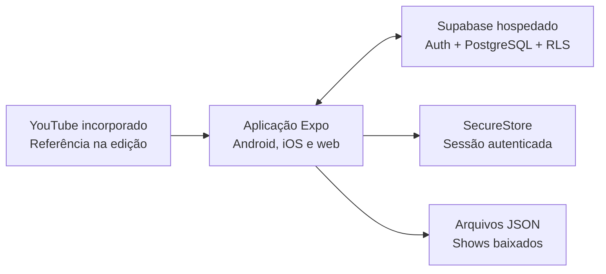

# Setlist

> Organize o show. Acompanhe a letra. Toque no tempo certo.

[](https://github.com/anderson-sillos/setlist/actions/workflows/ci.yml)

O **Setlist** é uma aplicação para bandas organizarem repertórios e shows e acompanharem letras sincronizadas durante uma apresentação. A proposta combina preparação colaborativa em Android, iOS e web, operação simples no palco e disponibilidade offline nos aplicativos móveis.

[Abrir prévia do aplicativo](https://anderson-sillos.github.io/setlist/app/) · [Visualizar apresentação](https://anderson-sillos.github.io/setlist/) · [Acompanhar tarefas](openspec/changes/definir-mvp-setlist/tasks.md) · [Proposta do MVP](openspec/changes/definir-mvp-setlist/proposal.md) · [Decisões de arquitetura](openspec/changes/definir-mvp-setlist/design.md) · [Handoff do Codex](docs/CODEX_HANDOFF.md)

## Status do projeto

O planejamento do MVP está completo no OpenSpec, com proposal, design, seis especificações e um checklist incremental. O incremento 1 está concluído e o incremento 2 está em revisão funcional. A primeira versão demonstrativa está publicada na web e oferece dados em memória, listas e detalhes responsivos e uma tela de palco com setlist, letra estática e cronômetro manual local.

O progresso detalhado pode ser consultado no [checklist de implementação](openspec/changes/definir-mvp-setlist/tasks.md). Cada caixa marcada corresponde a uma atividade implementada, verificada e registrada em commit.

## O problema

Durante a preparação e a execução de um show, músicos frequentemente precisam combinar informações espalhadas entre mensagens, documentos, anotações e diferentes aplicativos. Isso dificulta:

- organizar a ordem e a duração das músicas;
- compartilhar alterações com toda a banda;
- acompanhar a letra no momento correto;
- manter o material disponível quando a conexão do local é instável.

## Objetivos

O Setlist possui dois objetivos centrais:

1. **Organizar as músicas dos shows**, reunindo repertório, blocos e ordem de execução em uma setlist compartilhada.
2. **Apresentar as letras sincronizadas**, destacando cada linha de acordo com um cronômetro controlado pelo músico.

O aplicativo também deverá oferecer controle de acesso por banda, login social e funcionamento offline para shows baixados previamente.

## Escopo do MVP

| Área          | Comportamento inicial                                                                      |
| ------------- | ------------------------------------------------------------------------------------------ |
| Acesso        | Login com Google ou Apple e participação em uma ou mais bandas                             |
| Permissões    | Papéis de Owner, Editor e Member                                                           |
| Repertório    | Uma versão vigente por música, com arquivamento em vez de exclusão destrutiva              |
| Letras        | Texto estruturado em blocos e linhas, sem cifras ou transposição                           |
| Sincronização | Marcação manual do início de cada linha usando um vídeo visível do YouTube como referência |
| Shows         | Data, horário, local, observações, status e duplicação de shows anteriores                 |
| Setlists      | Blocos nomeados, músicas ordenadas e cálculo de duração                                    |
| Modo palco    | Cronômetro manual e independente por aparelho, letra destacada e controles rápidos         |
| Offline       | Download de pacotes de shows para leitura e apresentação, sem edição offline               |
| Atualizações  | Aviso quando uma música ou um pacote baixado estiver desatualizado                         |

## Fluxo principal

1. Um Owner cria a banda e convida os integrantes por link.
2. Owners e Editors cadastram as músicas e estruturam suas letras.
3. Um vídeo do YouTube é usado como referência para marcar o início de cada linha.
4. A banda cria o show, organiza os blocos e ordena a setlist.
5. Cada músico baixa o show no próprio aparelho.
6. No palco, o músico inicia seu cronômetro e acompanha a letra destacada.
7. A passagem para a próxima música acontece manualmente.

## Arquitetura proposta



### Tecnologias previstas

- **React Native com Expo** para compartilhar a base da aplicação entre Android, iOS e web.
- **Supabase hospedado** para autenticação, PostgreSQL e políticas de acesso com Row Level Security.
- **Google e Apple OAuth** para login social, sem senhas mantidas pelo Setlist.
- **Expo SecureStore** somente para persistir a sessão autenticada.
- **Arquivos JSON locais** para os pacotes de shows disponíveis offline.
- **Player incorporado do YouTube** apenas como referência durante a sincronização da letra.

SQLite e armazenamento local de músicas não fazem parte do MVP. O modo palco funciona com os tempos já preparados e não depende da reprodução do vídeo.

## Ambiente de desenvolvimento

Este roteiro descreve a configuração necessária para executar o estado atual do projeto. Ele deve ser atualizado no mesmo commit sempre que uma atividade alterar versões, dependências, variáveis de ambiente, comandos ou serviços externos.

### 1. Pré-requisitos

Obrigatórios em qualquer sistema:

- Git;
- Node.js 24;
- npm 11;
- um navegador moderno para executar a versão web.

#### Onde obter os componentes

| Componente              | Necessidade                                                          | Download ou instalação oficial                                                                  |
| ----------------------- | -------------------------------------------------------------------- | ----------------------------------------------------------------------------------------------- |
| Git                     | Obrigatório                                                          | [Downloads do Git](https://git-scm.com/downloads/)                                              |
| Node.js 24 LTS          | Obrigatório                                                          | [Downloads do Node.js](https://nodejs.org/en/download)                                          |
| npm 11                  | Obrigatório                                                          | Já acompanha a instalação do Node.js; não precisa ser instalado separadamente                   |
| nvm                     | Recomendado em Linux, macOS e WSL                                    | [Instalação do nvm](https://github.com/nvm-sh/nvm#installing-and-updating)                      |
| Navegador               | Obrigatório para web                                                 | [Chrome](https://www.google.com/chrome/) ou [Firefox](https://www.mozilla.org/firefox/new/)     |
| Visual Studio Code      | Editor recomendado                                                   | [Download do VS Code](https://code.visualstudio.com/Download)                                   |
| Expo Go para Android    | Necessário para testar em aparelho Android                           | [Expo Go para Android e SDK 57](https://expo.dev/go?device=true&platform=android&sdkVersion=57) |
| Expo Go para iOS/iPadOS | Necessário para testar em iPhone ou iPad                             | [Expo Go para iOS e SDK 57](https://expo.dev/go?device=true&platform=ios&sdkVersion=57)         |
| Android Studio          | Opcional; necessário para emulador e ferramentas Android             | [Download do Android Studio](https://developer.android.com/studio)                              |
| Xcode                   | Opcional; necessário para simulador e builds locais de iOS em um Mac | [Xcode no Apple Developer](https://developer.apple.com/xcode/)                                  |
| WSL                     | Opcional; ambiente Linux usado neste projeto no Windows              | [Instalação oficial do WSL](https://learn.microsoft.com/windows/wsl/install)                    |
| Conta Expo              | Gratuita; recomendada para o Expo Go e necessária para usar o EAS    | [Criar conta Expo](https://expo.dev/signup)                                                     |
| Apple Developer Program | Necessário para instalar builds Ad Hoc em iPhone ou iPad             | [Apple Developer Program](https://developer.apple.com/programs/)                                |

O arquivo `.nvmrc` fixa a versão principal do Node.js. O uso do [nvm](https://github.com/nvm-sh/nvm) é recomendado, mas não obrigatório; qualquer instalação compatível do Node.js 24 pode ser usada.

Para usar o VS Code com o projeto no WSL:

1. Instale o VS Code no Windows e marque a opção **Add to PATH** durante a instalação.
2. Instale a extensão oficial [WSL](https://marketplace.visualstudio.com/items?itemName=ms-vscode-remote.remote-wsl).
3. No terminal WSL, entre na pasta do projeto e execute:

```bash
code .
```

Na primeira execução, o VS Code instalará seu servidor no WSL. O arquivo `.vscode/extensions.json` recomenda também as extensões ESLint e Prettier usadas pela automação do projeto. Mais detalhes estão no [guia oficial do VS Code para WSL](https://code.visualstudio.com/docs/remote/wsl).

Para executar em dispositivos móveis, escolha uma ou mais opções:

- **aparelho Android ou iPhone/iPad:** instale o Expo Go e use a mesma rede do computador ou uma conexão por túnel;
- **emulador Android:** instale o Android Studio, o Android SDK e configure um dispositivo virtual;
- **simulador iOS:** use um Mac com Xcode e o iOS Simulator instalados.

O navegador e um aparelho físico com Expo Go são suficientes para o desenvolvimento inicial. Android Studio, Xcode, Docker, banco de dados local e Supabase local não são necessários nesta etapa.

### 2. Obter o código

Para uma primeira instalação:

```bash
git clone https://github.com/anderson-sillos/setlist.git
cd setlist
```

Para atualizar uma cópia existente com o código já integrado ao GitHub, entre na pasta do projeto e confirme primeiro que não há alterações locais pendentes:

```bash
cd setlist
git status --short
```

O resultado esperado do segundo comando é vazio. Se houver arquivos listados, registre ou preserve essas alterações antes de continuar. Em seguida, atualize a branch principal e reinstale exatamente as dependências do lockfile atualizado:

```bash
git switch main
git pull --ff-only origin main
npm ci
npm run validate
```

O uso de `--ff-only` impede que uma atualização rotineira crie um merge local inesperado. O `npm ci` reconstrói `node_modules`, mas não remove o `.env.local`, que permanece ignorado pelo Git. Ao final, `npm run validate` confirma formatação, lint, tipos e testes no código recebido.

Para trabalhar na implementação em andamento, consulte o PR ativo e troque para a branch correspondente. A branch `main` contém apenas os grupos já concluídos.

### 3. Selecionar o Node.js

Com nvm:

```bash
nvm install
nvm use
```

Confirme as versões antes de instalar as dependências:

```bash
node --version
npm --version
```

O resultado esperado é Node.js `v24.x` e npm `11.x`.

### 4. Instalar as dependências

```bash
npm ci
```

Use `npm ci` para reproduzir exatamente o `package-lock.json`. O comando substitui uma instalação anterior e não deve modificar o arquivo de lock.

Na versão atual, o npm informa alertas moderados em dependências transitivas do Expo. Não execute `npm audit fix --force`: a correção sugerida troca componentes centrais por versões incompatíveis. Alertas altos ou críticos devem bloquear a evolução até serem analisados.

### 5. Variáveis de ambiente

Crie a configuração local a partir do modelo versionado:

```bash
cp .env.example .env.local
```

No PowerShell, use `Copy-Item .env.example .env.local`. Preencha os dados do projeto Supabase hospedado correspondente ao ambiente:

| Variável                               | Uso                                               |
| -------------------------------------- | ------------------------------------------------- |
| `EXPO_PUBLIC_APP_ENV`                  | Ambiente explícito: `development` ou `production` |
| `EXPO_PUBLIC_SUPABASE_URL`             | URL HTTPS do projeto Supabase do ambiente         |
| `EXPO_PUBLIC_SUPABASE_PUBLISHABLE_KEY` | Chave pública usada pelo cliente                  |

Use projetos Supabase distintos para desenvolvimento e produção e altere `EXPO_PUBLIC_APP_ENV` no perfil de build. Não use `NODE_ENV` para selecionar arquivos `.env`, pois o Expo também controla essa variável durante exportações.

Consulte a [documentação de variáveis de ambiente do Expo](https://docs.expo.dev/guides/environment-variables/) para detalhes sobre carregamento e perfis de build.

A tela inicial ainda pode ser executada sem essa configuração porque não acessa o backend. Quando uma integração remota solicitar as variáveis, `src/config/environment.ts` valida tipos e valores e informa somente os nomes inválidos, sem incluir chaves ou seus conteúdos na mensagem de erro.

Valores `EXPO_PUBLIC_*` ficam visíveis no aplicativo compilado. A URL e a chave publicável do Supabase foram criadas para uso no cliente, mas segredos administrativos — especialmente uma `service_role` — nunca podem usar esse prefixo nem ser incluídos no aplicativo. Não adicione arquivos `.env` reais ao Git; somente exemplos sem valores sensíveis podem ser versionados.

### 6. Executar a aplicação

Inicie o servidor do Expo:

```bash
npm start
```

No terminal interativo do Expo, use `w` para navegador, `a` para Android ou `i` para o simulador iOS. Também é possível abrir diretamente uma plataforma:

```bash
npm run web
npm run android
npm run ios
```

A rota inicial exibe `Minhas bandas` e permite navegar por Shows, Repertório e Banda usando conteúdo demonstrativo local. As listas usam uma coluna em celulares, duas em tablets e três em telas de computador.

O comando para iOS requer macOS quando usado com o simulador. Em Linux ou Windows, teste iOS em um aparelho físico com Expo Go ou utilize posteriormente um build remoto apropriado.

### 7. Verificar a instalação

Execute toda a automação de qualidade antes de cada commit:

```bash
npm run validate
```

O comando executa, na ordem, as verificações abaixo:

| Comando                | Verificação                                              |
| ---------------------- | -------------------------------------------------------- |
| `npm run format:check` | Formatação consistente com Prettier                      |
| `npm run lint`         | Regras estáticas do ESLint e configuração oficial Expo   |
| `npm run typecheck`    | Tipos TypeScript sem geração de arquivos                 |
| `npm run test:ci`      | Testes Jest em modo CI, cobertura e limite global de 80% |

Durante o desenvolvimento, use `npm test` para uma execução simples, `npm run test:watch` para acompanhar alterações e `npm run format` para aplicar a formatação.

Quando dependências ou configuração do Expo forem alteradas, valide também a árvore, a compatibilidade e a geração dos pacotes:

```bash
npm ls --depth=0
npx expo install --check
npx expo export --platform all --output-dir dist
npm run export:web -- --output-dir dist
```

O workflow [Qualidade](.github/workflows/ci.yml) repete a instalação limpa, formatação, lint, tipos e testes em cada pull request e em cada envio para `main`. O resultado atual também pode ser consultado pelo selo no início deste README.

### 8. Testar em Android e iOS com Expo Go

O Expo Go permite revisar o aplicativo gratuitamente em um aparelho físico, sem gerar um APK ou um build iOS e sem pagar o Apple Developer Program. Ele abre o projeto servido pelo Metro no computador; portanto, mantenha o terminal do Expo em execução durante todo o teste.

#### 8.1. Criar e conectar uma conta Expo

A conta Expo é gratuita. Embora a leitura direta de um QR code local possa funcionar sem autenticação, use uma conta neste projeto para identificar o ambiente, encontrar o projeto no histórico do Expo Go e acessar futuramente os serviços EAS:

1. Acesse [expo.dev/signup](https://expo.dev/signup), informe os dados solicitados e confirme o e-mail.
2. Abra o Expo Go no Android ou iOS e entre com essa conta.
3. Na pasta do projeto, autentique a linha de comando e confira o usuário ativo:

```bash
npx expo login
npx expo whoami
```

Use a mesma conta no aplicativo e no terminal. Não é necessário ter uma conta Apple Developer para executar este roteiro no iPhone ou iPad; ela só é exigida para gerar e distribuir determinados builds iOS assinados.

#### 8.2. Preparar o projeto

Atualize o código e instale as dependências conforme as seções 2 a 5. Depois confirme a integridade da cópia local:

```bash
npm run validate
```

Instale no aparelho a edição atual do Expo Go compatível com o SDK 57 usando os links da tabela de pré-requisitos. Computador e aparelho devem estar com data e horário corretos.

#### 8.3. Iniciar pela rede local

Prefira a conexão LAN porque ela é mais rápida. O computador e o aparelho precisam estar na mesma rede Wi-Fi e a rede deve permitir comunicação entre dispositivos:

```bash
npx expo start --go --lan --clear
```

Mantenha esse terminal aberto. Quando o QR code aparecer:

- **Android:** abra o Expo Go, toque em **Scan QR code** e leia o código exibido no terminal.
- **iPhone ou iPad:** abra o aplicativo **Câmera**, leia o QR code e confirme **Abrir no Expo Go**.

Aguarde a transferência inicial do pacote. Na primeira abertura, aceite a permissão de rede local se o iOS a solicitar.

#### 8.4. Iniciar por túnel quando as redes forem diferentes

Não é obrigatório estar na mesma rede quando o modo túnel é usado. Se o celular estiver no 4G/5G, em outro Wi-Fi, ou se LAN/WSL2/firewall impedir a conexão, interrompa o servidor com `Ctrl+C` e execute:

```bash
npx expo start --go --tunnel --clear
```

Leia o novo QR code. Nesse modo, computador e aparelho precisam apenas de acesso à internet. O tráfego passa pelo ngrok, por isso a carga e as atualizações são mais lentas e dependem da disponibilidade desse serviço. Consulte também a seção [Android físico e WSL2](#android-físico-e-wsl2) se ocorrer `Failed to download remote update` ou `failed to start tunnel`.

#### 8.5. Executar a revisão nas duas plataformas

Repita este checklist em pelo menos um aparelho Android e um iPhone ou iPad:

- abrir a tela **Minhas bandas** e selecionar cada banda demonstrativa;
- navegar entre **Shows**, **Repertório** e **Banda**;
- abrir os detalhes de um show e de uma música;
- conferir os estados de show em preparação, pronto e cancelado;
- confirmar que o modo palco abre para um show pronto e permanece bloqueado para um show cancelado;
- iniciar, pausar, retomar e zerar o cronômetro local no modo palco;
- navegar pela setlist e conferir a letra estática da música;
- testar nas orientações vertical e horizontal e observar se textos e controles permanecem legíveis;
- registrar modelo do aparelho, versão do sistema, resultado e defeitos encontrados no PR.

Para recarregar todos os aparelhos conectados, pressione `r` no terminal do Expo. O Fast Refresh também aplica mudanças salvas automaticamente. Ao terminar, encerre o servidor com `Ctrl+C`. Como os dados atuais são demonstrativos e ficam em memória, reiniciar o aplicativo restaura seu estado inicial.

O Expo Go é adequado para esta revisão antecipada, mas não substitui um aplicativo independente assinado: ele depende do Expo Go e do servidor de desenvolvimento. Recursos futuros que exijam configuração nativa não incluída no Expo Go deverão ser testados em um development build ou build interno. O funcionamento offline planejado para shows também ainda não está implementado.

### 9. Publicar a prévia e gerar builds internos

A prévia web é publicada em [anderson-sillos.github.io/setlist/app/](https://anderson-sillos.github.io/setlist/app/). O workflow [Publicar GitHub Pages](.github/workflows/pages.yml) exporta a aplicação para `/setlist/app`, preserva a apresentação na raiz do site e publica ambas após cada envio para `main`. A variável `EXPO_WEB_BASE_URL` é usada somente nessa exportação para ajustar os caminhos do GitHub Pages; não precisa ser criada no ambiente local.

Para gerar builds internos, autentique a CLI pelo navegador e confirme a conta ativa:

```bash
npx --yes eas-cli@latest login --browser
npx --yes eas-cli@latest whoami
```

A configuração versionada em `eas.json` usa o perfil `preview` com distribuição interna. No Android, o resultado é um APK instalável diretamente. Gere uma plataforma ou as duas:

```bash
npm run build:preview:android
npm run build:preview:ios
npm run build:preview:all
```

Na primeira execução, o EAS solicita a vinculação a um projeto Expo e pode criar as credenciais de assinatura. O build Ad Hoc de iOS requer uma assinatura ativa no Apple Developer Program e pelo menos um iPhone ou iPad registrado. Antes de gerar esse build, registre o dispositivo seguindo o link ou QR code fornecido por:

```bash
npx --yes eas-cli@latest device:create
```

A autenticação fica no perfil local do usuário e as credenciais são administradas pelo EAS; não adicione tokens, certificados, perfis ou chaves ao repositório. Consulte a [documentação de distribuição interna do Expo](https://docs.expo.dev/build/internal-distribution/) para instalar e compartilhar os artefatos.

### 10. Problemas comuns

- **Cache do Metro inconsistente:** execute `npx expo start --clear`.
- **Dependência incompatível com o Expo:** execute `npx expo install --check` e instale pacotes nativos com `npx expo install <pacote>`.
- **Aparelho não encontra o servidor:** no modo LAN, confirme que os dois dispositivos estão na mesma rede, desative temporariamente VPNs que interfiram na rota e verifique se o firewall permite a porta exibida pelo Expo; em redes diferentes, use `npx expo start --go --tunnel --clear`.
- **Expo Go informa versão incompatível:** atualize o aplicativo pela loja, confirme que ele suporta o SDK 57 e reinicie o Metro com `npx expo start --go --clear`.
- **iOS não abre o projeto pela LAN:** em **Ajustes**, autorize o acesso do Expo Go à rede local e leia novamente o QR code com o aplicativo Câmera.
- **Emulador Android não abre:** inicialize o dispositivo virtual no Android Studio e confirme que `adb devices` o lista.
- **Atalho de iOS indisponível:** o iOS Simulator e builds locais para iOS exigem macOS e Xcode.
- **Porta do Expo ocupada:** execute `npx expo start --port 8082` ou escolha outra porta livre.

#### Android físico e WSL2

No modo NAT padrão do WSL2, o navegador do Windows consegue abrir o servidor do WSL por `localhost`, mas um celular na rede não alcança diretamente o endereço privado da máquina virtual. O sintoma no Expo Go pode ser `Failed to download remote update`, mesmo quando a versão web funciona.

A solução rápida é usar um túnel:

```bash
npx expo start --tunnel --clear
```

Na primeira execução, o Expo pode instalar `@expo/ngrok`. O túnel depende de um serviço externo, é mais lento e gera uma URL pública aleatória; use-o somente durante o desenvolvimento e encerre o processo ao terminar. Se aparecer `failed to start tunnel` ou `remote gone away`, consulte o [estado do ngrok](https://status.ngrok.com/) e tente novamente quando a conectividade estiver operacional.

No Windows 11 22H2 ou mais recente, a alternativa permanente recomendada é a rede espelhada do WSL2. Adicione estas opções ao arquivo `%USERPROFILE%\.wslconfig`, preservando outras configurações existentes:

```ini
[wsl2]
networkingMode=mirrored
hostAddressLoopback=true
```

Depois, execute no PowerShell como administrador:

```powershell
wsl --shutdown

New-NetFirewallHyperVRule `
  -Name "ExpoMetro8081" `
  -DisplayName "Expo Metro 8081" `
  -Direction Inbound `
  -VMCreatorId "{40E0AC32-46A5-438A-A0B2-2B479E8F2E90}" `
  -Protocol TCP `
  -LocalPorts 8081
```

Reabra o WSL, confirme que o computador e o celular estão na mesma rede e inicie o Expo pela LAN:

```bash
npx expo start --lan --clear
```

Consulte a [documentação de rede do WSL](https://learn.microsoft.com/windows/wsl/networking#mirrored-mode-networking) para requisitos, firewall e limitações do modo espelhado.

Se uma solução exigir uma mudança permanente no projeto, registre-a também neste roteiro.

## Papéis e permissões

| Papel  | Responsabilidades                                           |
| ------ | ----------------------------------------------------------- |
| Owner  | Administrar a banda, integrantes, papéis e todo o conteúdo  |
| Editor | Editar repertório, letras, sincronizações, shows e setlists |
| Member | Consultar conteúdo, baixar shows e utilizar o modo palco    |

Uma banda pode ter vários Owners, mas o último Owner não pode sair ou perder o papel até promover outro integrante.

## Princípios do produto

- **Confiável no palco:** o show baixado continua disponível sem internet.
- **Fonte única:** cada música possui uma única versão vigente dentro da banda.
- **Atualização consciente:** pacotes locais nunca são trocados silenciosamente antes de uma apresentação.
- **Controle local:** cada músico controla o próprio cronômetro e sua navegação.
- **Segurança por banda:** o backend valida a participação e o papel do usuário em cada operação.
- **MVP simples:** preparação online e execução offline evitam conflitos de edição e infraestrutura local adicional.

## Fora do MVP

- reconhecimento automático da música e de sua posição no áudio;
- sincronização dos cronômetros entre aparelhos;
- edição offline;
- armazenamento ou distribuição de arquivos de áudio;
- histórico de versões e arranjos alternativos;
- cifras e transposição;
- integração com Spotify.

## Estrutura atual

```text
.
|-- .nvmrc                              # Versão principal do Node.js
|-- .agents/skills/                      # Skills locais do OpenSpec
|-- .vscode/extensions.json              # Extensões recomendadas do editor
|-- docs/
|   |-- apresentacao.html                # Apresentação HTML em slides
|   `-- CODEX_HANDOFF.md                 # Continuidade entre sessões do Codex
|-- openspec/config.yaml                 # Configuração do OpenSpec
|-- openspec/changes/definir-mvp-setlist/
|   |-- proposal.md                      # Motivação e escopo
|   |-- design.md                        # Decisões e arquitetura
|   |-- specs/                           # Contratos de comportamento
|   `-- tasks.md                         # Plano incremental de implementação
|-- src/
|   |-- app/                             # Rotas e telas compartilhadas do Expo
|   |-- components/layout/               # Estruturas responsivas reutilizáveis
|   |-- components/ui/                   # Componentes visuais reutilizáveis
|   |-- config/environment.ts            # Leitura e validação tipada do ambiente
|   |-- data/demo/                        # Bandas, repertórios e shows demonstrativos
|   |-- data/in-memory/                   # Repositórios locais para testes e demonstração
|   |-- domain/                          # Entidades e contratos independentes da infraestrutura
|   |-- features/navigation/             # Fluxo inicial e áreas da banda
|   |-- features/stage/                  # Tela de palco e cronômetro manual local
|   |-- providers/                       # Contexto de dados e cache de consultas
|   `-- theme/                           # Tokens e breakpoints responsivos
|-- .env.example                         # Modelo público, sem credenciais reais
|-- .github/workflows/ci.yml             # Qualidade contínua no GitHub
|-- .github/workflows/pages.yml          # Exportação e publicação do site e da prévia
|-- app.config.ts                        # Base web variável para publicação em subdiretório
|-- app.json                             # Configuração de Android, iOS e web
|-- eas.json                             # Perfil de builds internos Android e iOS
|-- eslint.config.js                     # Regras estáticas do projeto Expo
|-- jest.config.js                       # Testes e cobertura mínima
|-- package.json                         # Dependências e comandos do projeto
`-- README.md
```

Para consultar o estado do planejamento pelo OpenSpec instalado no ambiente:

```bash
openspec status --change definir-mvp-setlist
```

## Próximas etapas

- validar antecipadamente YouTube, cronômetro e links de autenticação no incremento 3;
- adicionar backend e funcionalidades em incrementos revisáveis;
- conduzir o piloto com uma banda após as validações técnicas e jurídicas.

## Apresentação

A apresentação pode ser aberta pela [visualização publicada no GitHub Pages](https://anderson-sillos.github.io/setlist/). O arquivo-fonte autossuficiente está em [`docs/apresentacao.html`](docs/apresentacao.html) e possui layout responsivo para navegadores de computadores, Android, iPhone e iPad. Use as setas do teclado, os botões na tela ou gestos horizontais para navegar; a impressão do navegador gera uma versão em PDF com um slide por página.
