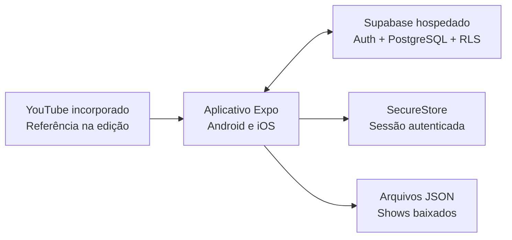

# Setlist

> Organize o show. Acompanhe a letra. Toque no tempo certo.

O **Setlist** é um aplicativo móvel para bandas organizarem repertórios e shows e acompanharem letras sincronizadas durante uma apresentação. A proposta combina preparação colaborativa, operação simples no palco e disponibilidade offline em celulares e tablets Android e iOS.

[Visualizar apresentação](https://anderson-sillos.github.io/setlist/) · [Proposta do MVP](openspec/changes/definir-mvp-setlist/proposal.md) · [Decisões de arquitetura](openspec/changes/definir-mvp-setlist/design.md)

## Status do projeto

O projeto está na fase de **definição do MVP**. A visão, o escopo inicial e as principais decisões técnicas já foram registrados com OpenSpec; a aplicação ainda não foi implementada.

## O problema

Durante a preparação e a execução de um show, músicos frequentemente precisam combinar informações espalhadas entre mensagens, documentos, anotações e diferentes aplicativos. Isso dificulta:

- organizar a ordem e a duração das músicas;
- compartilhar alterações com toda a banda;
- acompanhar a letra no momento correto;
- manter o material disponível quando a conexão do local é instável.

## Objetivos

O Setlist possui dois objetivos centrais:

1. **Organizar as músicas dos shows**, reunindo repertório, blocos e ordem de execução em uma setlist compartilhada.
2. **Apresentar as letras sincronizadas**, destacando cada linha de acordo com um cronômetro controlado pelo músico.

O aplicativo também deverá oferecer controle de acesso por banda, login social e funcionamento offline para shows baixados previamente.

## Escopo do MVP

| Área | Comportamento inicial |
| --- | --- |
| Acesso | Login com Google ou Apple e participação em uma ou mais bandas |
| Permissões | Papéis de Owner, Editor e Member |
| Repertório | Uma versão vigente por música, com arquivamento em vez de exclusão destrutiva |
| Letras | Texto estruturado em blocos e linhas, sem cifras ou transposição |
| Sincronização | Marcação manual do início de cada linha usando um vídeo visível do YouTube como referência |
| Shows | Data, horário, local, observações, status e duplicação de shows anteriores |
| Setlists | Blocos nomeados, músicas ordenadas e cálculo de duração |
| Modo palco | Cronômetro manual e independente por aparelho, letra destacada e controles rápidos |
| Offline | Download de pacotes de shows para leitura e apresentação, sem edição offline |
| Atualizações | Aviso quando uma música ou um pacote baixado estiver desatualizado |

## Fluxo principal

1. Um Owner cria a banda e convida os integrantes por link.
2. Owners e Editors cadastram as músicas e estruturam suas letras.
3. Um vídeo do YouTube é usado como referência para marcar o início de cada linha.
4. A banda cria o show, organiza os blocos e ordena a setlist.
5. Cada músico baixa o show no próprio aparelho.
6. No palco, o músico inicia seu cronômetro e acompanha a letra destacada.
7. A passagem para a próxima música acontece manualmente.

## Arquitetura proposta



### Tecnologias previstas

- **React Native com Expo** para compartilhar a base do aplicativo entre Android e iOS.
- **Supabase hospedado** para autenticação, PostgreSQL e políticas de acesso com Row Level Security.
- **Google e Apple OAuth** para login social, sem senhas mantidas pelo Setlist.
- **Expo SecureStore** somente para persistir a sessão autenticada.
- **Arquivos JSON locais** para os pacotes de shows disponíveis offline.
- **Player incorporado do YouTube** apenas como referência durante a sincronização da letra.

SQLite e armazenamento local de músicas não fazem parte do MVP. O modo palco funciona com os tempos já preparados e não depende da reprodução do vídeo.

## Papéis e permissões

| Papel | Responsabilidades |
| --- | --- |
| Owner | Administrar a banda, integrantes, papéis e todo o conteúdo |
| Editor | Editar repertório, letras, sincronizações, shows e setlists |
| Member | Consultar conteúdo, baixar shows e utilizar o modo palco |

Uma banda pode ter vários Owners, mas o último Owner não pode sair ou perder o papel até promover outro integrante.

## Princípios do produto

- **Confiável no palco:** o show baixado continua disponível sem internet.
- **Fonte única:** cada música possui uma única versão vigente dentro da banda.
- **Atualização consciente:** pacotes locais nunca são trocados silenciosamente antes de uma apresentação.
- **Controle local:** cada músico controla o próprio cronômetro e sua navegação.
- **Segurança por banda:** o backend valida a participação e o papel do usuário em cada operação.
- **MVP simples:** preparação online e execução offline evitam conflitos de edição e infraestrutura local adicional.

## Fora do MVP

- reconhecimento automático da música e de sua posição no áudio;
- sincronização dos cronômetros entre aparelhos;
- edição offline;
- armazenamento ou distribuição de arquivos de áudio;
- histórico de versões e arranjos alternativos;
- cifras e transposição;
- integração com Spotify.

## Estrutura atual

```text
.
|-- .agents/skills/                      # Skills locais do OpenSpec
|-- docs/apresentacao.html               # Apresentação HTML em slides
|-- openspec/config.yaml                 # Configuração do OpenSpec
|-- openspec/changes/definir-mvp-setlist/
|   |-- proposal.md                      # Motivação e escopo
|   `-- design.md                        # Decisões e pendências
`-- README.md
```

Para consultar o estado do planejamento:

```bash
openspec status --change definir-mvp-setlist
```

## Próximas etapas

- resolver as pendências de produto e experiência registradas no design;
- detalhar as capacidades em especificações OpenSpec;
- definir o modelo PostgreSQL e as políticas RLS;
- criar um protótipo da sincronização com o player do YouTube;
- decompor a implementação em tarefas;
- iniciar a aplicação Expo e validar o fluxo com uma banda piloto.

## Apresentação

A apresentação pode ser aberta pela [visualização publicada no GitHub Pages](https://anderson-sillos.github.io/setlist/). O arquivo-fonte autossuficiente está em [`docs/apresentacao.html`](docs/apresentacao.html). Use as setas do teclado, os botões na tela ou gestos horizontais para navegar; a impressão do navegador gera uma versão em PDF com um slide por página.
