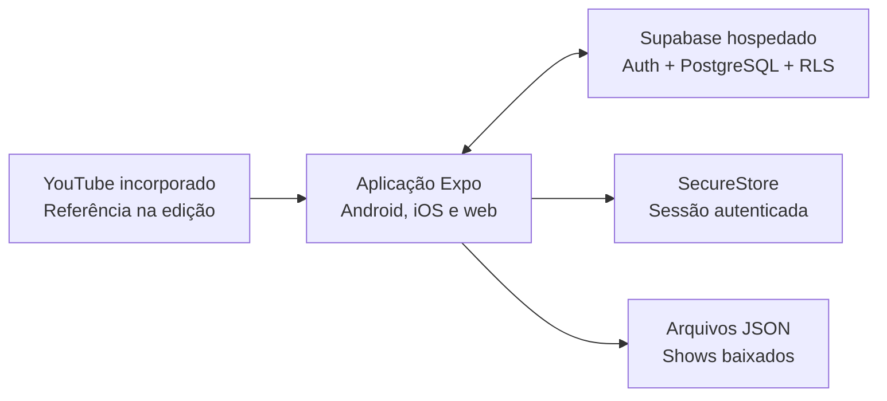

# Setlist

> Organize o show. Acompanhe a letra. Toque no tempo certo.

[](https://github.com/anderson-sillos/setlist/actions/workflows/ci.yml)

O **Setlist** é uma aplicação para bandas organizarem repertórios e shows e acompanharem letras sincronizadas durante uma apresentação. A proposta combina preparação colaborativa em Android, iOS e web, operação simples no palco e disponibilidade offline nos aplicativos móveis.

[Visualizar apresentação](https://anderson-sillos.github.io/setlist/) · [Acompanhar tarefas](openspec/changes/definir-mvp-setlist/tasks.md) · [Proposta do MVP](openspec/changes/definir-mvp-setlist/proposal.md) · [Decisões de arquitetura](openspec/changes/definir-mvp-setlist/design.md) · [Handoff do Codex](docs/CODEX_HANDOFF.md)

## Status do projeto

O planejamento do MVP está completo no OpenSpec, com proposal, design, seis especificações e um checklist incremental. A fundação multiplataforma está em implementação e já possui uma aplicação Expo executável em Android, iOS e web, com configuração tipada, automação de qualidade e um catálogo visual responsivo.

O progresso detalhado pode ser consultado no [checklist de implementação](openspec/changes/definir-mvp-setlist/tasks.md). Cada caixa marcada corresponde a uma atividade implementada, verificada e registrada em commit.

## O problema

Durante a preparação e a execução de um show, músicos frequentemente precisam combinar informações espalhadas entre mensagens, documentos, anotações e diferentes aplicativos. Isso dificulta:

- organizar a ordem e a duração das músicas;
- compartilhar alterações com toda a banda;
- acompanhar a letra no momento correto;
- manter o material disponível quando a conexão do local é instável.

## Objetivos

O Setlist possui dois objetivos centrais:

1. **Organizar as músicas dos shows**, reunindo repertório, blocos e ordem de execução em uma setlist compartilhada.
2. **Apresentar as letras sincronizadas**, destacando cada linha de acordo com um cronômetro controlado pelo músico.

O aplicativo também deverá oferecer controle de acesso por banda, login social e funcionamento offline para shows baixados previamente.

## Escopo do MVP

| Área          | Comportamento inicial                                                                      |
| ------------- | ------------------------------------------------------------------------------------------ |
| Acesso        | Login com Google ou Apple e participação em uma ou mais bandas                             |
| Permissões    | Papéis de Owner, Editor e Member                                                           |
| Repertório    | Uma versão vigente por música, com arquivamento em vez de exclusão destrutiva              |
| Letras        | Texto estruturado em blocos e linhas, sem cifras ou transposição                           |
| Sincronização | Marcação manual do início de cada linha usando um vídeo visível do YouTube como referência |
| Shows         | Data, horário, local, observações, status e duplicação de shows anteriores                 |
| Setlists      | Blocos nomeados, músicas ordenadas e cálculo de duração                                    |
| Modo palco    | Cronômetro manual e independente por aparelho, letra destacada e controles rápidos         |
| Offline       | Download de pacotes de shows para leitura e apresentação, sem edição offline               |
| Atualizações  | Aviso quando uma música ou um pacote baixado estiver desatualizado                         |

## Fluxo principal

1. Um Owner cria a banda e convida os integrantes por link.
2. Owners e Editors cadastram as músicas e estruturam suas letras.
3. Um vídeo do YouTube é usado como referência para marcar o início de cada linha.
4. A banda cria o show, organiza os blocos e ordena a setlist.
5. Cada músico baixa o show no próprio aparelho.
6. No palco, o músico inicia seu cronômetro e acompanha a letra destacada.
7. A passagem para a próxima música acontece manualmente.

## Arquitetura proposta



### Tecnologias previstas

- **React Native com Expo** para compartilhar a base da aplicação entre Android, iOS e web.
- **Supabase hospedado** para autenticação, PostgreSQL e políticas de acesso com Row Level Security.
- **Google e Apple OAuth** para login social, sem senhas mantidas pelo Setlist.
- **Expo SecureStore** somente para persistir a sessão autenticada.
- **Arquivos JSON locais** para os pacotes de shows disponíveis offline.
- **Player incorporado do YouTube** apenas como referência durante a sincronização da letra.

SQLite e armazenamento local de músicas não fazem parte do MVP. O modo palco funciona com os tempos já preparados e não depende da reprodução do vídeo.

## Ambiente de desenvolvimento

Este roteiro descreve a configuração necessária para executar o estado atual do projeto. Ele deve ser atualizado no mesmo commit sempre que uma atividade alterar versões, dependências, variáveis de ambiente, comandos ou serviços externos.

### 1. Pré-requisitos

Obrigatórios em qualquer sistema:

- Git;
- Node.js 24;
- npm 11;
- um navegador moderno para executar a versão web.

O arquivo `.nvmrc` fixa a versão principal do Node.js. O uso do [nvm](https://github.com/nvm-sh/nvm) é recomendado, mas não obrigatório; qualquer instalação compatível do Node.js 24 pode ser usada.

Para executar em dispositivos móveis, escolha uma ou mais opções:

- **aparelho Android ou iPhone/iPad:** instale o Expo Go e mantenha o computador e o aparelho na mesma rede;
- **emulador Android:** instale o Android Studio, o Android SDK e configure um dispositivo virtual;
- **simulador iOS:** use um Mac com Xcode e o iOS Simulator instalados.

O navegador e um aparelho físico com Expo Go são suficientes para o desenvolvimento inicial. Android Studio, Xcode, Docker, banco de dados local e Supabase local não são necessários nesta etapa.

### 2. Obter o código

```bash
git clone https://github.com/anderson-sillos/setlist.git
cd setlist
```

Para trabalhar na implementação em andamento, consulte o PR ativo e troque para a branch correspondente. A branch `main` contém apenas os grupos já concluídos.

### 3. Selecionar o Node.js

Com nvm:

```bash
nvm install
nvm use
```

Confirme as versões antes de instalar as dependências:

```bash
node --version
npm --version
```

O resultado esperado é Node.js `v24.x` e npm `11.x`.

### 4. Instalar as dependências

```bash
npm ci
```

Use `npm ci` para reproduzir exatamente o `package-lock.json`. O comando substitui uma instalação anterior e não deve modificar o arquivo de lock.

Na versão atual, o npm informa alertas moderados em dependências transitivas do Expo. Não execute `npm audit fix --force`: a correção sugerida troca componentes centrais por versões incompatíveis. Alertas altos ou críticos devem bloquear a evolução até serem analisados.

### 5. Variáveis de ambiente

Crie a configuração local a partir do modelo versionado:

```bash
cp .env.example .env.local
```

No PowerShell, use `Copy-Item .env.example .env.local`. Preencha os dados do projeto Supabase hospedado correspondente ao ambiente:

| Variável                               | Uso                                               |
| -------------------------------------- | ------------------------------------------------- |
| `EXPO_PUBLIC_APP_ENV`                  | Ambiente explícito: `development` ou `production` |
| `EXPO_PUBLIC_SUPABASE_URL`             | URL HTTPS do projeto Supabase do ambiente         |
| `EXPO_PUBLIC_SUPABASE_PUBLISHABLE_KEY` | Chave pública usada pelo cliente                  |

Use projetos Supabase distintos para desenvolvimento e produção e altere `EXPO_PUBLIC_APP_ENV` no perfil de build. Não use `NODE_ENV` para selecionar arquivos `.env`, pois o Expo também controla essa variável durante exportações.

Consulte a [documentação de variáveis de ambiente do Expo](https://docs.expo.dev/guides/environment-variables/) para detalhes sobre carregamento e perfis de build.

A tela inicial ainda pode ser executada sem essa configuração porque não acessa o backend. Quando uma integração remota solicitar as variáveis, `src/config/environment.ts` valida tipos e valores e informa somente os nomes inválidos, sem incluir chaves ou seus conteúdos na mensagem de erro.

Valores `EXPO_PUBLIC_*` ficam visíveis no aplicativo compilado. A URL e a chave publicável do Supabase foram criadas para uso no cliente, mas segredos administrativos — especialmente uma `service_role` — nunca podem usar esse prefixo nem ser incluídos no aplicativo. Não adicione arquivos `.env` reais ao Git; somente exemplos sem valores sensíveis podem ser versionados.

### 6. Executar a aplicação

Inicie o servidor do Expo:

```bash
npm start
```

No terminal interativo do Expo, use `w` para navegador, `a` para Android ou `i` para o simulador iOS. Também é possível abrir diretamente uma plataforma:

```bash
npm run web
npm run android
npm run ios
```

A rota inicial exibe o catálogo dos tokens e componentes básicos. Ela usa uma coluna em celulares, duas em tablets e três em telas de computador, o que permite conferir rapidamente a configuração responsiva em cada dispositivo.

O comando para iOS requer macOS quando usado com o simulador. Em Linux ou Windows, teste iOS em um aparelho físico com Expo Go ou utilize posteriormente um build remoto apropriado.

### 7. Verificar a instalação

Execute toda a automação de qualidade antes de cada commit:

```bash
npm run validate
```

O comando executa, na ordem, as verificações abaixo:

| Comando                | Verificação                                              |
| ---------------------- | -------------------------------------------------------- |
| `npm run format:check` | Formatação consistente com Prettier                      |
| `npm run lint`         | Regras estáticas do ESLint e configuração oficial Expo   |
| `npm run typecheck`    | Tipos TypeScript sem geração de arquivos                 |
| `npm run test:ci`      | Testes Jest em modo CI, cobertura e limite global de 80% |

Durante o desenvolvimento, use `npm test` para uma execução simples, `npm run test:watch` para acompanhar alterações e `npm run format` para aplicar a formatação.

Quando dependências ou configuração do Expo forem alteradas, valide também a árvore, a compatibilidade e a geração dos pacotes:

```bash
npm ls --depth=0
npx expo install --check
npx expo export --platform all --output-dir dist
```

O workflow [Qualidade](.github/workflows/ci.yml) repete a instalação limpa, formatação, lint, tipos e testes em cada pull request e em cada envio para `main`. O resultado atual também pode ser consultado pelo selo no início deste README.

### 8. Problemas comuns

- **Cache do Metro inconsistente:** execute `npx expo start --clear`.
- **Dependência incompatível com o Expo:** execute `npx expo install --check` e instale pacotes nativos com `npx expo install <pacote>`.
- **Aparelho não encontra o servidor:** confirme que os dois dispositivos estão na mesma rede e que o firewall permite a porta exibida pelo Expo.
- **Emulador Android não abre:** inicialize o dispositivo virtual no Android Studio e confirme que `adb devices` o lista.
- **Atalho de iOS indisponível:** o iOS Simulator e builds locais para iOS exigem macOS e Xcode.
- **Porta do Expo ocupada:** execute `npx expo start --port 8082` ou escolha outra porta livre.

Se uma solução exigir uma mudança permanente no projeto, registre-a também neste roteiro.

## Papéis e permissões

| Papel  | Responsabilidades                                           |
| ------ | ----------------------------------------------------------- |
| Owner  | Administrar a banda, integrantes, papéis e todo o conteúdo  |
| Editor | Editar repertório, letras, sincronizações, shows e setlists |
| Member | Consultar conteúdo, baixar shows e utilizar o modo palco    |

Uma banda pode ter vários Owners, mas o último Owner não pode sair ou perder o papel até promover outro integrante.

## Princípios do produto

- **Confiável no palco:** o show baixado continua disponível sem internet.
- **Fonte única:** cada música possui uma única versão vigente dentro da banda.
- **Atualização consciente:** pacotes locais nunca são trocados silenciosamente antes de uma apresentação.
- **Controle local:** cada músico controla o próprio cronômetro e sua navegação.
- **Segurança por banda:** o backend valida a participação e o papel do usuário em cada operação.
- **MVP simples:** preparação online e execução offline evitam conflitos de edição e infraestrutura local adicional.

## Fora do MVP

- reconhecimento automático da música e de sua posição no áudio;
- sincronização dos cronômetros entre aparelhos;
- edição offline;
- armazenamento ou distribuição de arquivos de áudio;
- histórico de versões e arranjos alternativos;
- cifras e transposição;
- integração com Spotify.

## Estrutura atual

```text
.
|-- .nvmrc                              # Versão principal do Node.js
|-- .agents/skills/                      # Skills locais do OpenSpec
|-- docs/
|   |-- apresentacao.html                # Apresentação HTML em slides
|   `-- CODEX_HANDOFF.md                 # Continuidade entre sessões do Codex
|-- openspec/config.yaml                 # Configuração do OpenSpec
|-- openspec/changes/definir-mvp-setlist/
|   |-- proposal.md                      # Motivação e escopo
|   |-- design.md                        # Decisões e arquitetura
|   |-- specs/                           # Contratos de comportamento
|   `-- tasks.md                         # Plano incremental de implementação
|-- src/
|   |-- app/                             # Rotas e telas compartilhadas do Expo
|   |-- components/ui/                   # Componentes visuais reutilizáveis
|   |-- config/environment.ts            # Leitura e validação tipada do ambiente
|   `-- theme/                           # Tokens e breakpoints responsivos
|-- .env.example                         # Modelo público, sem credenciais reais
|-- .github/workflows/ci.yml             # Qualidade contínua no GitHub
|-- app.json                             # Configuração de Android, iOS e web
|-- eslint.config.js                     # Regras estáticas do projeto Expo
|-- jest.config.js                       # Testes e cobertura mínima
|-- package.json                         # Dependências e comandos do projeto
`-- README.md
```

Para consultar o estado do planejamento pelo OpenSpec instalado no ambiente:

```bash
openspec status --change definir-mvp-setlist
```

## Próximas etapas

- concluir variáveis de ambiente, automação de qualidade, base visual responsiva e integração contínua do incremento 1;
- disponibilizar a primeira versão navegável com dados demonstrativos no incremento 2;
- validar antecipadamente YouTube, cronômetro e links de autenticação;
- adicionar backend e funcionalidades em incrementos revisáveis;
- conduzir o piloto com uma banda após as validações técnicas e jurídicas.

## Apresentação

A apresentação pode ser aberta pela [visualização publicada no GitHub Pages](https://anderson-sillos.github.io/setlist/). O arquivo-fonte autossuficiente está em [`docs/apresentacao.html`](docs/apresentacao.html) e possui layout responsivo para navegadores de computadores, Android, iPhone e iPad. Use as setas do teclado, os botões na tela ou gestos horizontais para navegar; a impressão do navegador gera uma versão em PDF com um slide por página.
