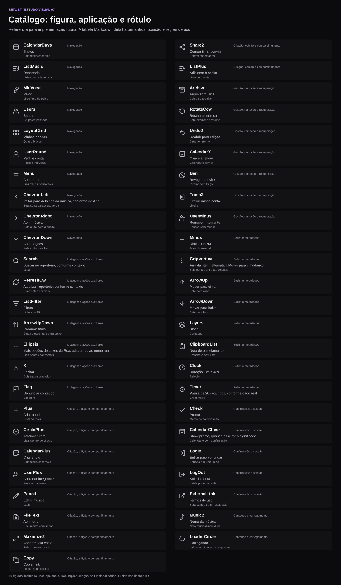

# Setlist — catálogo de ícones propostos e aplicações

**Data:** 05/10/2026

**Status:** proposta de iconografia; indicadores de status de música e show aplicados parcialmente.

**Cobertura:** inventário das figuras propostas, seus usos e das ações que devem usar somente texto.

Este catálogo organiza a direção de [Content-First Darkness](PROPOSTA_UI_CONTENT_FIRST_DARKNESS.md#99-revisão-completa-da-iconografia) por figura e aplicação. O inventário dos 54 identificadores atuais e suas substituições permanece na proposta principal. Aqui, símbolos que hoje compartilham um identificador são separados pelo significado da ação.

## Como ler a lista

- Cada linha traz uma miniatura vetorial da figura. O fundo arredondado escuro serve apenas para mostrar o desenho no documento; não acrescenta um botão ou preenchimento à interface. O desenho ocupa 24 em uma amostra de 40; as medidas de uso permanecem na tabela.
- Os nomes das figuras são os componentes Lucide propostos. Nome de componente não é rótulo de interface.
- As medidas se referem ao desenho, em CSS px na Web e unidades de layout no React Native. O alvo de toque continua com pelo menos 48 × 48 no celular.
- Ícone ao lado de texto usa gap de 8; navegação lateral usa slot de 24 e gap de 12; barra inferior mantém rótulo abaixo, com gap de 4.
- Cor padrão: `#B8B8C2`; seleção: `#B692FF`; texto principal: `#F4F4F5`. A cor acompanha o estado e o papel semântico da proposta.
- “Opcional” e “condicional” indicam usos a avaliar, não controles novos obrigatórios.
- Ícone sem texto visual continua com nome acessível. Figura decorativa não recebe foco ou um segundo anúncio.
- Símbolos de marca, Google e Apple são tratados separadamente ao final.

## Navegação

| Visual                                                                | Figura proposta                                | Aplicação no app                                    | Texto / nome acessível                           | Tamanho e posição                                            | Regra de uso                                                                     |
| --------------------------------------------------------------------- | ---------------------------------------------- | --------------------------------------------------- | ------------------------------------------------ | ------------------------------------------------------------ | -------------------------------------------------------------------------------- |
|  | **`CalendarDays`** — Calendário com dias       | Menu Shows, itens da lista de shows e seletor de data | Shows / Selecionar data                          | 20 no lateral; 22 no inferior; 40 em slot de 48 no card      | Data comum; não implica show pronto.                                             |
|        | **`ListMusic`** — Lista com nota musical       | Menu Repertório no lateral, drawer e barra inferior | Repertório                                       | 20 no lateral; 22 no inferior; slot de 24                    | Substitui Music na navegação; identifica uma coleção.                            |
|          | **`MicVocal`** — Microfone de palco            | Item Palco no lateral, drawer e barra inferior      | Palco                                            | 20 no lateral; 22 no inferior; mesmo slot dos demais         | Abre o aviso de versão futura; não reproduz ou grava áudio.                      |
|                | **`Users`** — Grupo de pessoas                 | Menu Banda e agrupamento de integrantes             | Banda / Integrantes                              | 20–22; mesmo eixo dos outros destinos                        | Não usar como figura de Convidar.                                                |
|      | **`LayoutGrid`** — Quatro blocos               | Destino geral Minhas bandas                         | Minhas bandas                                    | 20 no lateral; 22 no drawer; à esquerda                      | Manter o rótulo para comunicar coleção de bandas.                                |
|        | **`UserRound`** — Pessoa individual            | Perfil e conta; avatar sem foto                     | Perfil e conta                                   | 20–22 na navegação; proporcional dentro do avatar            | Avatar é decorativo; não precisa de novo botão.                                  |
|                  | **`Menu`** — Três traços horizontais           | Cabeçalho móvel para abrir o menu lateral           | Abrir menu                                       | 32 centralizado; alvo de 48 × 48                             | Só ícone visual; não usar para arrastar itens.                                   |
|    | **`ChevronLeft`** — Seta curta para a esquerda | Voltar de detalhe, editor ou leitura                | Voltar para detalhes da música, conforme destino | 32 à esquerda do cabeçalho; alvo de 48 × 48                   | Nome acessível identifica o destino.                                             |
|  | **`ChevronRight`** — Seta curta para a direita | Abrir detalhe de música, show ou banda              | Abrir música / Abrir show                        | 18–20 no final da linha                                      | Não acrescentar se o controle de abertura já for evidente.                       |
|    | **`ChevronDown`** — Seta curta para baixo      | Seletores, filtros e grupos expansíveis             | Abrir opções / Expandir bloco                    | 16–18 à direita do valor ou título                           | Estado expandido deve ser informado; não usar como botão separado desnecessário. |

## Listagem e ações auxiliares

| Visual                                                              | Figura proposta                                  | Aplicação no app                                | Texto / nome acessível                              | Tamanho e posição                                       | Regra de uso                                                           |
| ------------------------------------------------------------------- | ------------------------------------------------ | ----------------------------------------------- | --------------------------------------------------- | ------------------------------------------------------- | ---------------------------------------------------------------------- |
|            | **`Search`** — Lupa                              | Campos de busca de bandas, músicas e shows      | Buscar no repertório, conforme contexto             | 20 dentro do campo à esquerda                           | Decorativo quando o próprio campo já tem nome acessível.               |
|      | **`RefreshCw`** — Duas setas em ciclo            | Atualizar consultas e listagens                 | Atualizar repertório, conforme contexto             | 18–20 à direita da busca na Web; alvo de 48 no celular  | Só ícone visual; não usar para reabrir show ou restaurar música.       |
|    | **`ListFilter`** — Linhas de filtro              | Controles de filtros das listas                 | Filtros / Filtros, 2 ativos                         | 18–20 à esquerda do texto                               | Manter texto e indicação de filtros ativos.                            |
|  | **`ArrowUpDown`** — Setas para cima e para baixo | Ordenação de repertório e shows                 | Ordenar: título / Ordenar: data                     | 18–20 à esquerda do texto                               | Não confundir com mover um item na setlist.                            |
|        | **`Ellipsis`** — Três pontos horizontais         | Mais opções de música, show, integrante ou item | Mais opções de Luzes da Rua, adaptando ao nome real | 18–20 no final da linha ou toolbar                      | Ações sensíveis aparecem em texto dentro do menu.                      |
|                      | **`X`** — Dois traços cruzados                   | Fechar popup, drawer ou sheet; limpar busca     | Fechar / Limpar busca                               | 20–24 no topo direito; 16–18 para limpar campo          | Nunca representa exclusão de conta/banda ou remoção de integrante.     |
|                | **`Flag`** — Bandeira                            | Denúncia de música/conteúdo e integrante        | Denunciar conteúdo / Denunciar integrante           | 18; próximo às ações contextuais; alvo de 48 no celular | Ícone discreto; tooltip na Web e opção textual no menu correspondente. |

## Criação, edição e compartilhamento

| Visual                                                                | Figura proposta                           | Aplicação no app                                              | Texto / nome acessível                         | Tamanho e posição                        | Regra de uso                                                                    |
| --------------------------------------------------------------------- | ----------------------------------------- | ------------------------------------------------------------- | ---------------------------------------------- | ---------------------------------------- | ------------------------------------------------------------------------------- |
|                  | **`Plus`** — Sinal de mais                | Criar banda, música, convite; adicionar bloco/item            | Criar banda / Adicionar música / Criar convite | 18–20 à esquerda do texto; gap de 8      | Substitui os badges de mais sobrepostos; não usar sozinho para criação ambígua. |
|      | **`CirclePlus`** — Mais dentro de círculo | Alternativa condicional para inserção sem botão já delimitado | Adicionar item                                 | 18–20 junto ao rótulo, se adotado        | Fora do padrão principal; preferir Plus dentro de botão circular ou cápsula.    |
|  | **`CalendarPlus`** — Calendário com mais  | Ação contextual de criação de show                            | Criar show                                     | 18–20 à esquerda do texto                | Plus é alternativa suficiente no CTA geral; usar apenas uma figura.             |
|          | **`UserPlus`** — Pessoa com mais          | Abrir convite de integrante na tela Banda                     | Convidar integrante                            | 18–20 à esquerda do texto                | Troca Users no botão Convidar; não representa criar uma nova banda.             |
|              | **`Pencil`** — Lápis                      | Editar música, dados da banda, perfil ou setlist              | Editar música / Editar setlist                 | 18–20 junto ao título da região editável | Preferir texto visível quando houver várias regiões editáveis.                  |
|          | **`FileText`** — Documento com linhas     | Abrir leitura de letra a partir do detalhe                    | Abrir letra                                    | 18–20 à esquerda do texto                | Novo papel; substitui a indicação genérica de expansão na entrada da leitura.   |
|        | **`Maximize2`** — Setas para expandir     | Expandir uma visualização já aberta                           | Abrir em tela cheia                            | 18–20 no cabeçalho da visualização       | Representa expansão, não reprodução; condicional ao controle existente.         |
|                  | **`Copy`** — Folhas sobrepostas           | Copiar link de convite e duplicar show                        | Copiar link / Duplicar show                    | 18–20 à esquerda da opção ou botão       | Rótulo distingue cópia do link de criação de outro show.                        |
|              | **`Share2`** — Pontos conectados          | Compartilhar ou recompartilhar convite                        | Compartilhar convite                           | 18–20 na ação contextual do convite      | Opera sobre o convite existente; não significa duplicá-lo.                      |
|          | **`ListPlus`** — Lista com mais           | Alternativa para inserir música em uma setlist                | Adicionar à setlist                            | 18–20 à esquerda do texto                | Usar apenas se distinguir esse contexto ajudar; Plus + texto continua válido.   |

## Gestão, remoção e recuperação

| Visual                                                          | Figura proposta                            | Aplicação no app                                      | Texto / nome acessível                             | Tamanho e posição                               | Regra de uso                                                                      |
| --------------------------------------------------------------- | ------------------------------------------ | ----------------------------------------------------- | -------------------------------------------------- | ----------------------------------------------- | --------------------------------------------------------------------------------- |
|      | **`Archive`** — Caixa de arquivo           | Arquivar música no repertório                         | Arquivar música                                    | 18–20 à esquerda da opção no menu               | Operação reversível; não substituir por lixeira.                                  |
|  | **`RotateCcw`** — Seta circular de retorno | Restaurar música arquivada ou renovar convite         | Restaurar música / Renovar convite                 | 18–20 na opção contextual, com texto            | Mesmo desenho, papéis separados por rótulo; diferente de atualizar dados.         |
|          | **`Undo2`** — Seta de retorno              | Reabrir show para Rascunho/edição                     | Reabrir para edição / Reabrir como Rascunho        | 18–20 à esquerda da opção                       | Não usar o lápis ou o refresh para simular recuperação de estado.                 |
|  | **`CalendarX`** — Calendário com X         | Cancelar show                                         | Cancelar show                                      | 18–20 à esquerda da opção; confirmação em popup | Substitui CalendarMinus; não implica exclusão definitiva.                         |
|              | **`Ban`** — Círculo com traço              | Revogar convite                                       | Revogar convite                                    | 18–20 no menu contextual, com texto             | Rótulo e confirmação identificam o convite; não confundir com suspensão de conta. |
|        | **`Trash2`** — Lixeira                     | Excluir conta, banda, música ou show quando permitido | Excluir minha conta / Excluir banda / Excluir show | 18–20 no menu/botão, com texto                  | Ação destrutiva e confirmação explícita; substitui X nessas aplicações.           |
|  | **`UserMinus`** — Pessoa com menos         | Remover integrante da banda                           | Remover integrante                                 | 18–20 à esquerda da opção                       | Remove vínculo; não sugere apagar a conta da pessoa.                              |

## Setlist e metadados

| Visual                                                                  | Figura proposta                                  | Aplicação no app                                   | Texto / nome acessível                           | Tamanho e posição                                 | Regra de uso                                                            |
| ----------------------------------------------------------------------- | ------------------------------------------------ | -------------------------------------------------- | ------------------------------------------------ | ------------------------------------------------- | ----------------------------------------------------------------------- |
|                  | **`Minus`** — Traço horizontal                   | Diminuir valor, separador, retirar item da setlist | Diminuir BPM / Separador / Remover da setlist    | 16–18 junto ao controle; com texto nas remoções   | Retirar item da setlist não exclui a música do repertório.              |
|    | **`GripVertical`** — Seis pontos em duas colunas | Alça de arraste de itens e blocos                  | Arrastar item; alternativa Mover para cima/baixo | 18–20 na primeira coluna; região de 48 no celular | Substitui Menu comprimido; não deforma o vetor.                         |
|              | **`ArrowUp`** — Seta para cima                   | Alternativa acessível de reordenação               | Mover para cima                                  | 18–20 na opção do menu de reordenação             | Move só o item correspondente; não ordena toda a lista.                 |
|          | **`ArrowDown`** — Seta para baixo                | Alternativa acessível de reordenação               | Mover para baixo                                 | 18–20 na opção do menu de reordenação             | Complementa ArrowUp e o arraste.                                        |
|                | **`Layers`** — Camadas                           | Identificação opcional de bloco de setlist         | Bloco / nome do bloco                            | 16–18 antes do nome do grupo                      | Retirar se repetir uma estrutura já clara pelo título e agrupamento.    |
|  | **`ClipboardList`** — Prancheta com lista        | Notas e itens de planejamento do show              | Nota de planejamento                             | 16–18 junto ao item, ou 18–20 na criação          | Substitui HourglassCog quando o conteúdo é uma instrução.               |
|                  | **`Clock`** — Relógio                            | Duração estimada de música, show ou setlist        | Duração: 3min 42s / 3:42                         | 16 junto ao valor no resumo/detalhe               | Substitui Hourglass; em listas repetitivas preferir o valor sem figura. |
|                  | **`Timer`** — Cronômetro                         | Item de planejamento com pausa/tempo explícito     | Pausa de 20 segundos, conforme dado real         | 16–18 junto ao valor                              | Não representa uma nota genérica nem ativa um cronômetro novo.          |

## Confirmação e sessão

| Visual                                                                  | Figura proposta                                  | Aplicação no app                                       | Texto / nome acessível                                                | Tamanho e posição                             | Regra de uso                                                                    |
| ----------------------------------------------------------------------- | ------------------------------------------------ | ------------------------------------------------------ | --------------------------------------------------------------------- | --------------------------------------------- | ------------------------------------------------------------------------------- |
|                  | **`Check`** — Marca de confirmação               | Opção selecionada, status pronto, confirmação de etapa | Pronto / Marcar como Pronto / opção selecionada                       | 14–16 no chip; 18–20 na ação                  | Não usar por padrão no botão Salvar; cor semântica acompanha o contexto.        |
|  | **`CalendarCheck`** — Calendário com confirmação | Evento explicitamente confirmado/pronto                | Show pronto, quando esse for o significado                            | 16–20 junto ao estado ou opção                | Uso condicional; data comum usa CalendarDays e estado permanece em texto.       |
|                  | **`LogIn`** — Entrada por uma porta              | Entrada genérica antes de continuar um convite         | Entrar para continuar                                                 | 18–20 junto ao texto, opcional                | Login Google/Apple usa símbolo do provedor, sem uma segunda figura de entrada.  |
|                | **`LogOut`** — Saída por uma porta               | Sair da sessão ou deixar a banda                       | Sair da conta / Sair da banda                                         | 18–20 à esquerda do texto                     | Rótulo distingue as operações; sair da banda mantém sua confirmação específica. |
|    | **`ExternalLink`** — Seta saindo de um quadrado  | Termos, privacidade e referência externa de vídeo      | Termos de uso / Política de privacidade / Abrir referência no YouTube | 14–16 no rodapé; 18–20 em botão; após o texto | O link inteiro recebe interação; não criar foco separado para a figura.         |

## Conteúdo e carregamento

| Visual                                                                | Figura proposta                                      | Aplicação no app                                 | Texto / nome acessível                 | Tamanho e posição                                       | Regra de uso                                                                                     |
| --------------------------------------------------------------------- | ---------------------------------------------------- | ------------------------------------------------ | -------------------------------------- | ------------------------------------------------------- | ------------------------------------------------------------------------------------------------ |
|              | **`Music2`** — Nota musical individual               | Itens da lista de músicas do repertório          | Música                                           | 40 em slot de 48 à esquerda do card; 32–40 em estado vazio  | Identifica o tipo de conteúdo sem sugerir reprodução.                         |
|  | **`LoaderCircle`** — Indicador circular de progresso | Carregamento de lista, salvamento ou atualização | Carregando… / Salvando… / Atualizando… | 18–20 junto ao rótulo; indicador nativo quando adequado | Substitui temporariamente a figura da ação; não cria novo botão e respeita redução de movimento. |

## Indicadores de status usados no `StatusPill`

Nas listas e nos resumos compactos, o `StatusPill` mede 24 × 24 px e o desenho do ícone mede 16 × 16 px. O ícone e a superfície semântica reduzem o espaço ocupado; o nome completo do estado permanece no rótulo acessível. As miniaturas abaixo mostram a figura ampliada para facilitar a identificação.

| Visual | Ícone Lucide (`AppIcon`) | Estado representado | Tom visual |
| --- | --- | --- | --- |
|  | `Check` (`check`) | Letra sincronizada | Verde de sucesso |
|  | `CircleAlert` (`alert`) | Sincronização incompleta | Âmbar de atenção |
|  | `FileX2` (`fileMissing`) | Música sem letra | Âmbar de atenção |
|  | `FileText` (`fileText`) | Letra estática | Neutro |
|  | `CircleDashed` (`showDraft`) | Show em rascunho | Neutro |
|  | `Check` (`check`) | Show pronto | Verde de sucesso |
|  | `CircleX` (`showCancelled`) | Show cancelado | Vermelho discreto |

O nome acessível informa, por exemplo, “Status da letra: Sincronização incompleta” ou “Status: Cancelado”. Em cards clicáveis, o status também integra o rótulo acessível do card.

## Ações e informações que devem usar texto

| Ação / informação      | Apresentação proposta                                         | Aplicação                                                                                  |
| ---------------------- | ------------------------------------------------------------- | ------------------------------------------------------------------------------------------ |
| Salvar                 | **Salvar**, sem check ou disquete                             | Editor de música, setlist, perfil e formulários; enquanto aguarda, indicador + “Salvando…” |
| Cancelar               | **Cancelar**, sem X                                           | Ação secundária de formulário/edição; o X fica reservado ao fechamento/limpeza             |
| Entendi                | **Entendi**, sem símbolo                                      | Popup de disponibilidade futura e mensagens informativas                                   |
| Alterar permissão      | **Alterar permissão** ou verbo específico                     | Gestão de integrante; evitar selo de escudo que sugira conta verificada                    |
| Papel do integrante    | **Proprietário**, **Editor**, **Membro**, conforme papel real | Lista de integrantes, contexto da banda e convites                                         |
| Tom e BPM              | **Tom G**, **BPM 120**                                        | Metadados da música; sem ícone para cada atributo                                          |
| Duração em lista densa | **3:42**                                                      | Coluna/linha de metadados; Clock reservado a resumo quando ajudar                          |
| Nome do bloco          | Nome do bloco em texto                                        | Cabeçalho da setlist; Layers opcional quando acrescentar informação                        |
| Documentos legais      | **Termos de uso**, **Política de privacidade**                | Rodapé de login/menu; ExternalLink pequeno ao final quando útil                            |

## Marca e autenticação

| Visual                                                                              | Elemento     | Proposta                                                                                        | Aplicação / medidas                                                                                              |
| ----------------------------------------------------------------------------------- | ------------ | ----------------------------------------------------------------------------------------------- | ---------------------------------------------------------------------------------------------------------------- |
|  | Logo Setlist | Preservar nota branca e fundo `#7C3AED`; cantos com raio de 25% do lado, sem contorno adicional | Login: 48–64, raio 12–16; menu/cabeçalho: 28–32, raio 7–8; proporção original                                    |
| Variante oficial na implementação                                                   | Google       | Símbolo colorido apropriado ao fundo escuro                                                     | Botão “Continuar com Google”; slot equivalente ao da Apple; dimensionar a arte visível conforme variante oficial |
| Variante oficial na implementação                                                   | Apple        | Símbolo branco apropriado ao fundo escuro                                                       | Botão “Continuar com Apple”; mesmo alinhamento e peso visual do Google                                           |

Os botões sociais seguem fundo `#1C1C1F`, borda `#74747F` e texto `#F4F4F5`. A representação na proposta não substitui a validação de variantes oficiais na implementação.

## Regras para aplicar sem ambiguidade

1. **Fechar não é excluir:** X fecha/limpa; Trash2 exclui; UserMinus remove integrante; Minus retira item da setlist.
2. **Atualizar não é recuperar:** RefreshCw consulta dados; RotateCcw restaura/renova; Undo2 reabre show. O texto contextual acompanha as operações de recuperação.
3. **Palco não é reprodução:** MicVocal + “Palco” abre o aviso nesta versão; mantém a seção anterior selecionada.
4. **Criar não exige badges:** Plus + verbo e objeto substitui sobreposições de mais em música/grupo.
5. **Ícone não precisa aparecer em todo lugar:** omitir o símbolo quando o texto ou a estrutura já comunicam a função.
6. **Texto não pode ser trocado por tooltip em ação sensível:** excluir, remover integrante, revogar e alterar permissão precisam de palavras claras no menu e na confirmação.
7. **Não deformar figuras:** usar vetor original, slot estável e a escala de tamanhos da proposta.

## Referências da proposta

- [Revisão dos ícones atuais e decisões por aplicação](PROPOSTA_UI_CONTENT_FIRST_DARKNESS.md#99-revisão-completa-da-iconografia).
- [Exemplo da barra inferior](design/content-first-darkness/05-menu-inferior.svg).
- [Exemplo do menu lateral](design/content-first-darkness/06-menu-lateral.svg).
- [Catálogo atual no código](../src/components/ui/AppIcon.tsx).
- Os desenhos do catálogo foram extraídos do pacote Lucide instalado; a licença ISC está incorporada ao SVG.

As figuras não ativam funções novas. Controles condicionais só devem aparecer quando houver a ação correspondente no produto.

## Registro da aplicação

O mapa do `AppIcon` foi migrado para as figuras e distinções deste inventário, preservando os identificadores usados pelo produto. O logo nas telas usa raio proporcional de 25%; favicons têm os cantos externos transparentes, e os assets de instalação continuam sem arredondamento adicional para respeitar as máscaras do Android/iOS. A revisão visual da marca e dos ícones dentro das telas ainda precisa ser concluída manualmente em Web, Android e iOS.
