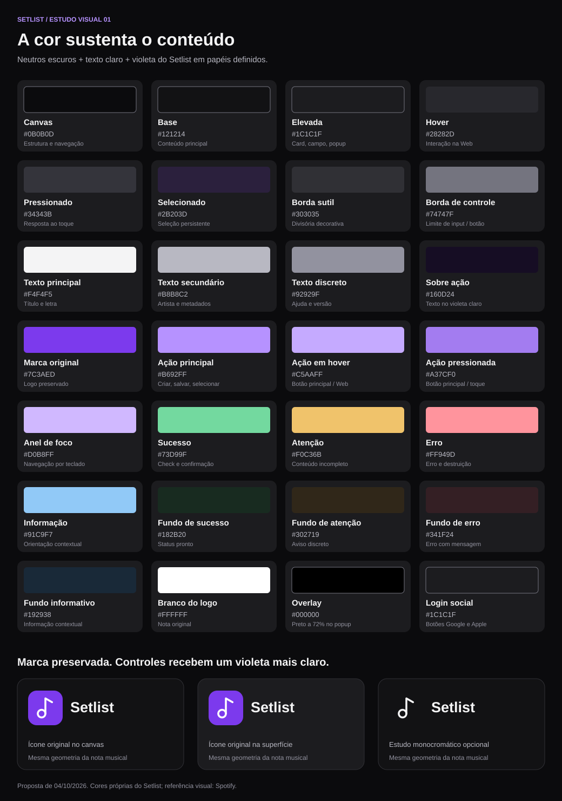
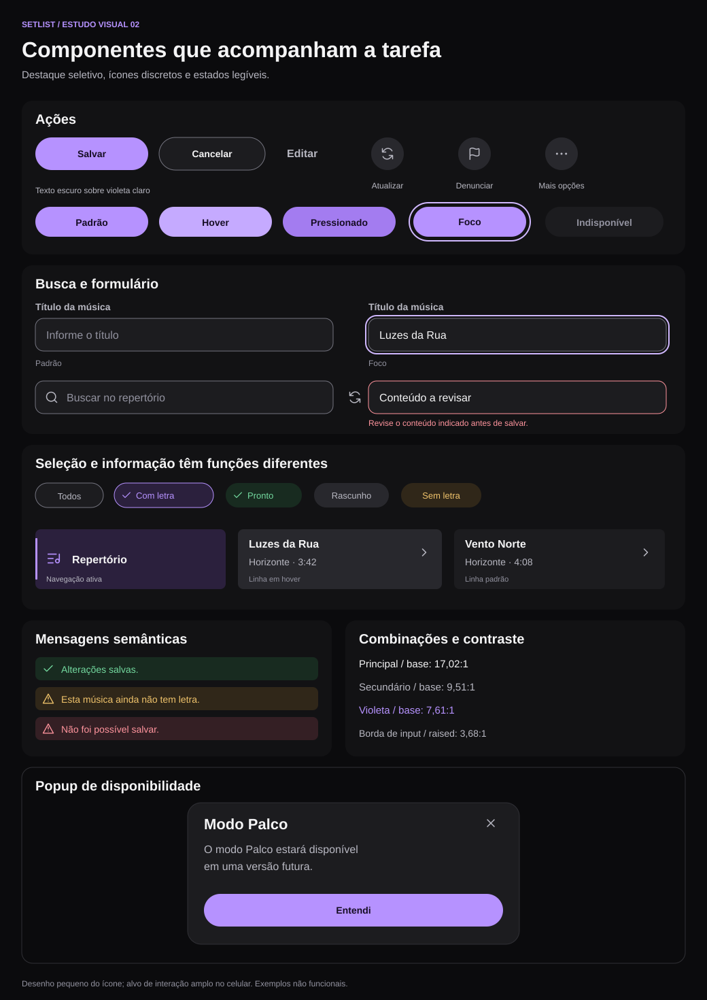
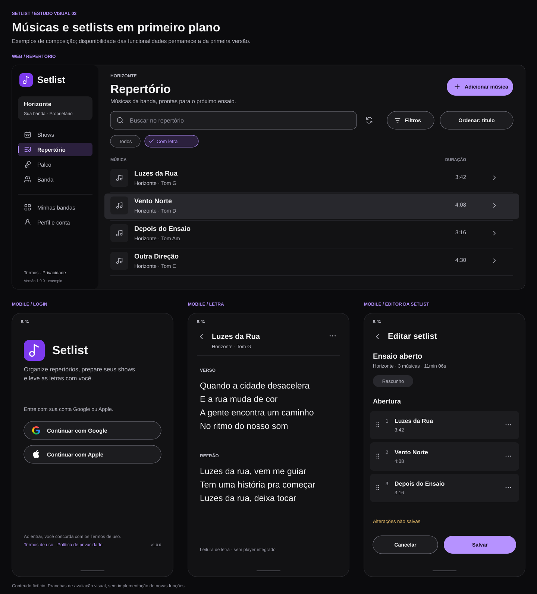
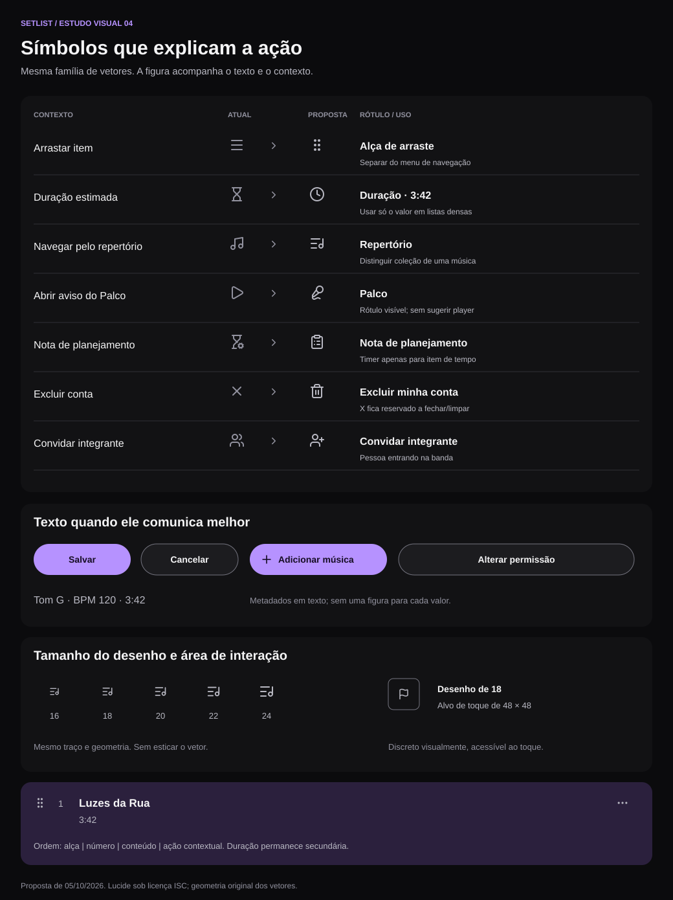
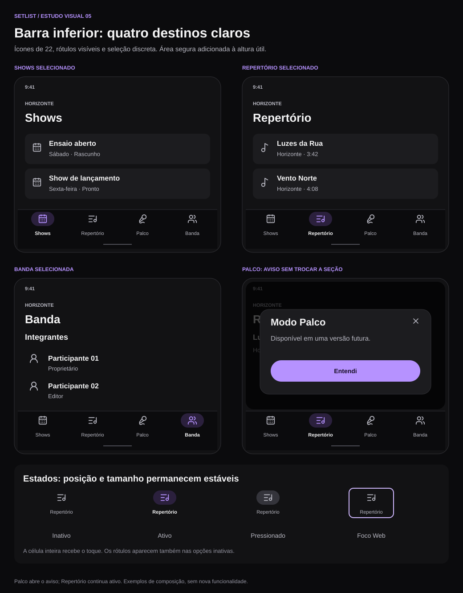
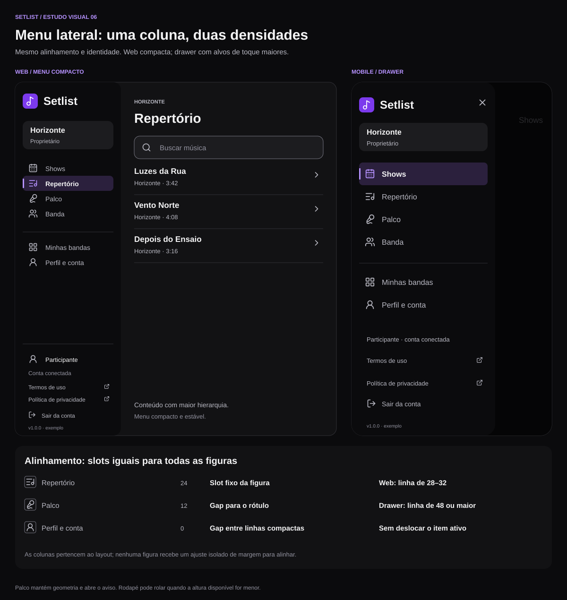

# Setlist — proposta de UI e UX: Content-First Darkness

**Data:** 04/10/2026  
**Atualização:** 05/10/2026 — iconografia visual, logo arredondado e proposta de UX, gestos e movimento.  
**Status:** proposta para avaliação visual e de interação; nenhuma alteração de interface aplicada.  
**Abrangência:** Web, Android e iOS, considerando as funcionalidades da primeira versão.  
**Direção recomendada:** superfícies escuras neutras, conteúdo claro, violeta do Setlist usado com economia e componentes consistentes.

## 1. Visão geral

O Setlist deve parecer uma biblioteca de trabalho musical: repertório fácil de percorrer, shows fáceis de preparar e letras confortáveis de ler. O olhar deve encontrar primeiro o nome da música, o próximo show e a sequência da setlist. Navegação, filtros, indicadores e ações acompanham essa leitura com menor peso visual.

Nesta proposta, **Content-First Darkness** é o nome da direção visual adotada para o Setlist. Significa construir a hierarquia pelo conteúdo, pela tipografia e pelo espaço, usando fundos escuros para sustentar essa organização. Não é apresentado como método oficial do Spotify.

A recomendação é preservar a nota musical e o violeta do ícone atual. O violeta original continua identificando a marca; um violeta mais claro passa a identificar controles e seleções sobre fundos escuros. As grandes áreas azuis e os fundos pastel da interface atual dão lugar a cinzas quase pretos.

A proposta de experiência complementa essa aparência: preservar contexto ao navegar, facilitar retorno e usar movimento breve para explicar mudanças. A [seção de UX, gestos e transições](#14-experiência-de-uso-gestos-e-movimento) descreve comportamento por plataforma, cuidados com edição e melhorias a validar com pessoas.

### Pranchas da proposta

Os exemplos têm conteúdo fictício e representam a aparência pretendida. Não são capturas do aplicativo nem protótipos funcionais. Os SVGs podem ser abertos individualmente e ampliados sem perda de definição.

## 2. Referência Spotify e adaptação ao Setlist

A referência visual usa os exemplos de interfaces e entidades apresentados no [guia oficial de design do Spotify](https://developer.spotify.com/documentation/design). A leitura para o Setlist é uma interpretação de design: áreas escuras, títulos claros, agrupamentos com espaço e controles com destaque seletivo. A paleta abaixo é uma proposta própria; não reproduz tokens internos do Spotify.

| Aspecto da referência                       | Aplicação proposta no Setlist                                                         |
| ------------------------------------------- | ------------------------------------------------------------------------------------- |
| Conteúdo musical como ponto de atenção      | Nome da música, artista, letra e ordem da setlist ocupam a hierarquia principal       |
| Estrutura escura com superfícies distintas  | Navegação, conteúdo e popups separados por níveis neutros de fundo                    |
| Uma cor reconhecível para ações importantes | Violeta claro para criar, salvar, selecionar e focar                                  |
| Listas fáceis de percorrer                  | Linhas com título, informação secundária e ações alinhadas                            |
| Controles arredondados                      | Botões e filtros com cantos suaves, em escala coerente                                |
| Imagens como conteúdo                       | Usar imagem apenas quando existir no produto; músicas podem usar texto e ícone neutro |

A interface deve continuar comunicando organização de repertórios e shows. Símbolos de reprodução ficam restritos às funções que efetivamente reproduzam algo; abrir uma letra usa uma ação de leitura. Capas inventadas, controles de streaming, mini player e carrosséis de recomendação não compõem esta proposta. As funcionalidades de Palco e player integrado continuam com a disponibilidade definida para a primeira versão.

## 3. Diagnóstico da interface atual

A avaliação foi feita sobre os arquivos do projeto, incluindo os tokens, componentes compartilhados, navegação, login, repertório e leitura de letras. Não houve auditoria visual de cada tela em execução.

| Elemento atual                               | Evidência no projeto                                          | Evolução proposta                                                                                                                    |
| -------------------------------------------- | ------------------------------------------------------------- | ------------------------------------------------------------------------------------------------------------------------------------ |
| Fundo geral claro                            | `paper: #F8F7FC`, `surface: #FFFFFF` em `src/theme/tokens.ts` | Conteúdo sobre `#121214`; estrutura externa sobre `#0B0B0D`                                                                          |
| Menu e leitura em azul escuro                | `navy: #0B1020`, `navyRaised: #18213F`                        | Unificar com a escala neutra de superfícies                                                                                          |
| Texto principal escuro                       | `ink: #172033`                                                | Texto principal quase branco `#F4F4F5`                                                                                               |
| Violeta escuro em texto                      | `violetDark: #5B21B6` em `AppText`                            | Texto de ação em `#B692FF`                                                                                                           |
| Botões secundários claros e contorno violeta | `AppButton`                                                   | Controles neutros; violeta reservado à ação principal                                                                                |
| Cards com borda e padding amplo              | `Card` usa borda de 1 e padding de 24                         | Usar linhas contínuas em listas densas, exceto nas listas de Shows e Repertório, que usam cards por item para identificar o conteúdo |
| Metadados e setas coloridos                  | Duração e chevron no repertório usam violeta                  | Usar cinza secundário; título fica mais evidente                                                                                     |
| Estados por opacidade                        | Botões e linhas usam redução geral de opacidade               | Definir cores de estado e preservar contraste do conteúdo                                                                            |
| Estilos específicos fora dos tokens          | Ex.: `#AAB3CE` no menu lateral                                | Centralizar papéis semânticos de cor                                                                                                 |
| Ícones consistentes disponíveis              | `AppIcon` usa `lucide-react-native`                           | Manter família, ajustar hierarquia e slots                                                                                           |
| Logo simples e reconhecível                  | `assets/icons/app-icon.svg` e PNGs derivados                  | Manter desenho e cor original                                                                                                        |

Esses pontos pedem revisão por componente. Uma troca literal de todas as ocorrências de `surface` ou `violet` produziria conflitos: hoje `surface` representa tanto fundo quanto texto branco, e `violet` identifica marca, ações e informações secundárias.

## 4. Princípios de composição

1. **Conteúdo primeiro:** título, artista, data e sequência têm precedência sobre decoração.
2. **Escuridão com níveis:** fundo, agrupamentos e popups têm superfícies distintas; a separação também usa espaço e títulos.
3. **Cor com função:** violeta indica ação ou seleção; verde indica sucesso; âmbar indica atenção; vermelho indica erro ou destruição.
4. **Poucos contornos:** bordas fortes identificam controles que precisam de limite visível. Divisórias decorativas podem ser discretas.
5. **Consistência entre plataformas:** mesmos significados, paleta e hierarquia, respeitando teclado, mouse, toque e áreas seguras.
6. **Densidade confortável:** listas compactas, texto legível e área de toque suficiente.
7. **Estados explicáveis:** erro, bloqueio ou indisponibilidade sempre têm mensagem compreensível.

Como orientação de composição, a maior parte da tela deve permanecer neutra. Violeta aparece principalmente na ação de maior prioridade, na seleção e no foco. Não há uma porcentagem obrigatória de pixels coloridos; a verificação é se o destaque compete com o conteúdo.

## 5. Paleta proposta

Todos os valores abaixo são cores sólidas em sRGB. Os nomes representam a função visual futura e não alterações já feitas nos tokens.

### 5.1 Fundos e superfícies

| Token proposto        | Cor             | Uso                                                             |
| --------------------- | --------------- | --------------------------------------------------------------- |
| `background.canvas`   | `#0B0B0D`       | Fundo externo, menu lateral, drawer e barra inferior            |
| `background.base`     | `#121214`       | Tela e região principal de leitura/listagem                     |
| `background.raised`   | `#1C1C1F`       | Cards, inputs, menus, popups e sheets                           |
| `background.hover`    | `#28282D`       | Hover de linha/controle neutro na Web                           |
| `background.pressed`  | `#34343B`       | Pressão em controle neutro                                      |
| `background.selected` | `#2B203D`       | Seleção de item ou filtro, acompanhada de marcador              |
| `background.overlay`  | `#000000` a 72% | Escurecimento atrás de popup; validar contraste após composição |

**Combinação de referência:** fundo externo `#0B0B0D` + painel principal `#121214` + popup `#1C1C1F`. A elevação aparece pela superfície, localização e espaçamento. Sombra discreta pode reforçar popups na Web; não é a única pista de profundidade.

### 5.2 Texto e ícones

| Token proposto   | Cor       | Uso                                                                      |
| ---------------- | --------- | ------------------------------------------------------------------------ |
| `text.primary`   | `#F4F4F5` | Títulos, texto digitado, nomes de músicas, letra                         |
| `text.secondary` | `#B8B8C2` | Artista, data, tom, BPM, descrições e ícones auxiliares                  |
| `text.muted`     | `#92929F` | Versão, ajuda breve, placeholder; usar sobre base/raised/hover           |
| `text.onAccent`  | `#160D24` | Texto e ícones dentro do botão violeta claro                             |
| `text.onBrand`   | `#FFFFFF` | Nota musical no ícone original                                           |
| `text.disabled`  | `#92929F` | Controle indisponível sobre `#1C1C1F`; explicar motivo quando necessário |

`text.muted` não deve ser usado automaticamente sobre qualquer fundo: sobre `background.pressed`, usar `text.secondary`. Informação necessária para executar uma tarefa nunca deve ser escondida em contraste baixo.

Ícones herdam o papel do texto adjacente: principal para ação atual, secundário para navegação inativa, violeta para seleção, semântico para alerta. Não colorir todos os ícones musicais em violeta.

### 5.3 Marca, ação e foco

| Token proposto   | Cor       | Uso                                                               |
| ---------------- | --------- | ----------------------------------------------------------------- |
| `brand.original` | `#7C3AED` | Ícone oficial e assinatura da marca                               |
| `action.primary` | `#B692FF` | Botão principal, link, checkbox selecionado, indicador de seleção |
| `action.hover`   | `#C5AAFF` | Hover do botão principal                                          |
| `action.pressed` | `#A37CF0` | Pressão do botão principal                                        |
| `focus.ring`     | `#D0B8FF` | Contorno de foco perceptível por teclado                          |

O violeta original não precisa clarear no ícone. O violeta claro resolve o contraste de controles e links sobre superfícies escuras. Os dois pertencem à mesma família visual, com papéis separados.

### 5.4 Bordas

| Token proposto    | Cor       | Uso                                                          |
| ----------------- | --------- | ------------------------------------------------------------ |
| `border.subtle`   | `#303035` | Divisórias e limites decorativos de agrupamentos             |
| `border.control`  | `#74747F` | Inputs, botões secundários e limites essenciais de controles |
| `border.selected` | `#B692FF` | Seleção que necessita de contorno                            |
| `border.focus`    | `#D0B8FF` | Foco, idealmente 2 unidades de espessura e afastamento de 2  |
| `border.error`    | `#FF949D` | Campo inválido, acompanhado de mensagem                      |

`border.subtle` não fornece contraste suficiente para identificar sozinho um input ou checkbox. A borda `control` deve ficar restrita aos elementos em que o contorno ajuda a entender a interação; aplicá-la a todos os cards criaria ruído visual.

### 5.5 Cores semânticas

| Significado                   | Texto/ícone | Fundo de apoio | Exemplo                            |
| ----------------------------- | ----------- | -------------- | ---------------------------------- |
| Sucesso / show pronto         | `#73D99F`   | `#182B20`      | Check + “Pronto”                   |
| Atenção / informação faltante | `#F0C36B`   | `#302719`      | Aviso + “Sem letra”                |
| Erro / ação destrutiva        | `#FF949D`   | `#341F24`      | Alerta + “Não foi possível salvar” |
| Informação                    | `#91C9F7`   | `#192938`      | Informação de permissão ou conexão |
| Neutro / rascunho             | `#B8B8C2`   | `#28282D`      | “Rascunho”                         |

Não usar verde para a navegação selecionada. Não usar vermelho em “Denunciar” no estado normal: a bandeira é uma ação discreta, não um alerta permanente.

## 6. Contraste e acessibilidade

Os valores abaixo foram calculados pela razão de luminância relativa de cores sRGB sólidas. São verificações da paleta, não uma certificação de acessibilidade do aplicativo. O W3C estabelece contraste mínimo de 4,5:1 para texto comum e 3:1 para texto grande, nas condições definidas pelo critério. A proposta usa 4,5:1 como piso também para seus rótulos pequenos. [WCAG — contraste de texto](https://www.w3.org/WAI/WCAG22/Understanding/contrast-minimum.html).

| Primeiro plano / fundo | Razão   | Aplicação                           |
| ---------------------- | ------- | ----------------------------------- |
| `#F4F4F5` / `#121214`  | 17,02:1 | Conteúdo principal                  |
| `#B8B8C2` / `#121214`  | 9,51:1  | Conteúdo secundário                 |
| `#92929F` / `#1C1C1F`  | 5,53:1  | Ajuda e versão                      |
| `#92929F` / `#28282D`  | 4,77:1  | Texto discreto em hover             |
| `#B692FF` / `#121214`  | 7,61:1  | Links e ícones selecionados         |
| `#B692FF` / `#2B203D`  | 6,21:1  | Seleção                             |
| `#160D24` / `#B692FF`  | 7,65:1  | Botão principal                     |
| `#160D24` / `#A37CF0`  | 6,00:1  | Botão principal pressionado         |
| `#74747F` / `#121214`  | 4,05:1  | Limite do input contra a tela       |
| `#74747F` / `#1C1C1F`  | 3,68:1  | Limite do input contra seu interior |
| `#74747F` / `#28282D`  | 3,18:1  | Limite de controle em hover         |
| `#D0B8FF` / `#1C1C1F`  | 9,70:1  | Foco sobre superfície elevada       |
| `#73D99F` / `#182B20`  | 8,65:1  | Sucesso                             |
| `#F0C36B` / `#302719`  | 8,90:1  | Atenção                             |
| `#FF949D` / `#341F24`  | 7,29:1  | Erro                                |
| `#91C9F7` / `#192938`  | 8,41:1  | Informação                          |

**Combinação a evitar:** `#F4F4F5` sobre `#B692FF` tem apenas **2,24:1**. Por isso o botão principal recebe texto escuro. Já o mesmo quase branco sobre o violeta original `#7C3AED` tem 5,18:1; o logo usa branco puro.

Limites e ícones essenciais precisam de contraste suficiente; bordas decorativas podem ser sutis quando a informação é identificável por outras pistas. A paleta distingue essas duas funções. [WCAG — contraste de elementos gráficos e controles](https://www.w3.org/WAI/WCAG22/Understanding/non-text-contrast.html).

### Regras de interação acessível

- Manter alvo de toque de **48 × 48** para botões de ícone em Android/iOS, mesmo quando o desenho tem 18–20 unidades.
- No menu lateral da Web, preservar a densidade atual: linhas de 28–32 CSS px, sem gap vertical adicional; no drawer por toque, usar linhas de 48 unidades. A WCAG 2.2 estabelece 24 × 24 CSS px ou condições de espaçamento/exceções; a proposta adota alvos maiores no celular. [WCAG — tamanho mínimo do alvo](https://www.w3.org/WAI/WCAG22/Understanding/target-size-minimum.html).
- Não sobrepor áreas de toque ao ampliar `hitSlop`; o layout deve reservar espaço para cada controle.
- Fornecer nome acessível para ícones sem texto: “Atualizar repertório”, “Denunciar conteúdo”, “Mais opções da música”. Na Web, incluir tooltip em hover e foco.
- Manter foco visível e ordem de teclado coerente. Ícones decorativos não entram na ordem de foco.
- Textos devem acompanhar as preferências de tamanho do sistema. Evitar alturas rígidas em blocos que podem crescer.
- Diferenciar estados por texto, ícone ou forma, além de cor: check no selecionado, rótulo de status, mensagem no erro.
- Não depender de hover para descobrir uma ação essencial; garantir acesso por toque e teclado.
- Validar zoom de 200% na Web, fontes ampliadas, VoiceOver, TalkBack e navegação sem mouse.
- Evitar afirmar que o tema escuro melhora a leitura para todos. Avaliar letras longas e uso em luz forte no teste de usabilidade; um modo claro pode ser uma evolução posterior se os resultados pedirem.

## 7. Tipografia, espaçamento e geometria

### Tipografia

Manter a família sem serifa do sistema: iOS usa a fonte padrão da plataforma, Android usa a padrão nativa, e Web usa uma pilha de fontes do sistema. Isso evita adicionar uma fonte para imitar a identidade tipográfica do Spotify. A consistência vem de tamanhos, pesos e alinhamentos.

| Papel               | Tamanho / entrelinha | Peso    | Uso                                 |
| ------------------- | -------------------- | ------- | ----------------------------------- |
| Título de seção     | 28–32 / 34–38        | 700     | Repertório, Shows, Minhas bandas    |
| Título de detalhe   | 24–28 / 30–36        | 700     | Música, show, banda                 |
| Cabeçalho de grupo  | 18–20 / 24–28        | 600–700 | Integrantes, bloco da setlist       |
| Título de linha     | 16 / 22              | 600     | Música, convite, show               |
| Corpo / formulário  | 16 / 24              | 400     | Texto digitado, descrições          |
| Metadado            | 13–14 / 18–20        | 400–500 | Artista, duração, data, permissão   |
| Letra em tela cheia | 24 / 36–38           | 400–500 | Texto integral e blocos             |
| Rótulo de controle  | 14–16 / 20–24        | 600     | Salvar, Criar show, filtro          |
| Rodapé legal        | 12 / 18              | 400     | Disclaimer e links                  |
| Versão              | 10–11 / 14–16        | 400     | Informação secundária sem interação |

Os números são CSS px na Web e unidades de layout no React Native; fontes seguem a escala de acessibilidade da plataforma. A versão continua discreta, mas com contraste adequado. Não estender a fonte pequena da versão às instruções e aos controles.

Nomes de músicas podem ocupar duas linhas no celular. Artista pode ser abreviado na lista, com informação completa no detalhe. Dados importantes não devem sumir em um conjunto de chips minúsculos. Durações e números ordenados devem usar algarismos tabulares quando a fonte suportar.

### Espaçamento e raios

- Escala: **4, 8, 12, 16, 24, 32, 48**. Reaproveitar a escala já existente.
- Margens laterais: 16 no celular; 24 no tablet; 32 na área principal do desktop.
- Intervalo entre título e apoio: 4–8; entre grupos de conteúdo: 24–32.
- Linhas de repertório: referência de 72–84 no celular para título + artista/metadados, com crescimento para textos longos.
- Padding de card: 16; popup: 24; listas não precisam de card por item.
- Raios: 8 para linhas selecionadas e pequenos agrupamentos; 12 para campos; 16 para cards; 20 para popups; 999 para botões/chips em cápsula.
- Nenhum brilho neon, sombra colorida ou gradiente recorrente. Um fundo sólido basta para títulos e cards.

## 8. Logo e identidade

### Decisão recomendada: preservar a nota e arredondar a apresentação do logo

O arquivo `assets/icons/app-icon.svg` contém uma nota musical branca sobre quadrado violeta `#7C3AED`. A forma simples, o traço arredondado e a referência musical combinam com a direção proposta. A prancha de paleta mostra esse desenho com cantos arredondados sobre canvas e sobre superfície elevada.

- Manter o ícone de instalação, favicon e imagens existentes nesta etapa.
- No login, usar o ícone com 48–64 unidades ao lado do nome Setlist.
- No menu lateral/cabeçalho, usar 28–32 unidades, com proporção preservada.
- Adotar cantos arredondados com **raio de 25% do lado**: 7–8 para logo de 28–32; 12–16 para logo de 48–64. Na arte vetorial com prancheta de 24, usar raio 6.
- Arredondar somente o fundo violeta, sem esticar a imagem, cortar a nota ou acrescentar uma borda. Manter o desenho e o espaçamento interno atuais.
- No ícone de instalação, respeitar a máscara de cada plataforma e preparar os assets exigidos na implementação; os exemplos arredondados aqui representam a apresentação dentro do app.
- Reservar aproximadamente 8 unidades de espaço ao redor em usos pequenos; afastar de botões e indicadores.
- Usar o nome Setlist em `text.primary`, peso 700, sem glow e sem gradiente.

### Alternativa opcional para aplicações muito compactas

A prancha também mostra uma versão monocromática da **mesma geometria**, sem o quadrado violeta. Ela serve como estudo de uma assinatura mais silenciosa sobre o menu escuro. Não substitui o ícone oficial e não exige redesenhar a nota. Só deve avançar se o teste mostrar que o quadrado chama atenção excessiva em espaços pequenos.

Não há conflito visual que justifique mudar o símbolo nesta proposta. A mudança necessária está nos papéis das cores da interface. O violeta claro dos controles não deve substituir automaticamente o violeta original da marca.

## 9. Padrões de componentes

### 9.1 Botões

| Variante              | Fundo                         | Texto / ícone    | Borda                  | Uso                                   |
| --------------------- | ----------------------------- | ---------------- | ---------------------- | ------------------------------------- |
| Principal             | `action.primary`              | `text.onAccent`  | Sem contorno adicional | Criar banda, Adicionar música, Salvar |
| Secundário            | `background.raised`           | `text.primary`   | `border.control`       | Cancelar, Convidar, ação alternativa  |
| Terciário             | Transparente                  | `text.secondary` | Nenhuma                | Editar, Voltar, ação contextual       |
| Ícone discreto        | Transparente                  | `text.secondary` | Nenhuma                | Atualizar, Denunciar, Mais opções     |
| Destrutivo confirmado | `semantic.danger` (`#FF949D`) | `text.onAccent`  | Nenhuma                | Excluir após confirmação              |

Altura principal: 48. Padding horizontal: 20–24. Ícone: 18–20. Na Web, uma variante compacta pode ter 36–40 de altura para ações de toolbar; no celular, reservar 48 para o alvo.

No cabeçalho, menu, voltar e ações principais usam ícones de 32 dentro de alvos de 48 × 48. Essa exceção aumenta a visibilidade sem alterar o layout nem reduzir a área de toque. Cancelar permanece com ícone de 22–24; ações auxiliares fora do cabeçalho seguem a escala compacta abaixo.

Uma região de tarefa tem uma ação principal evidente. “Editar” no detalhe da música pode ser neutro; dentro do editor, “Salvar” fica violeta. O botão de atualizar permanece apenas com ícone, à direita da busca na Web. Não transformar denunciar, duração, chevron e todas as ações em botões preenchidos.

### 9.2 Busca e formulários

- Campo com `background.raised`, borda `control`, texto `primary` e placeholder `muted`.
- Ícone de busca de 20; altura de 48; raio de 12; padding de 12–16.
- Rótulos persistentes acima do campo. Placeholder complementa o rótulo, sem substituí-lo.
- No foco: anel externo `focus.ring`; preservar o texto e a borda interna.
- Campo inválido: borda `error`, mensagem clara abaixo e anúncio acessível.
- Exemplo de bloqueio preventivo: “Não foi possível salvar. Revise o conteúdo indicado e tente novamente.” Não mostrar apenas borda vermelha ou fechar o editor.
- Controles de seleção têm opção selecionada identificada por check e/ou contorno.
- Editor de letra usa texto claro, fonte normal e área escura legível; não aplicar toda a letra em violeta.

### 9.3 Chips, filtros e status

Filtros são controles; status são informação. Eles podem compartilhar cantos arredondados, mas precisam ter função perceptível.

- Chip de filtro não selecionado: fundo `raised`, borda `control`, texto `secondary`.
- Selecionado: fundo `selected`, texto e borda `action.primary`, check quando couber.
- Quantidade de filtros ativos aparece no próprio controle de filtro; o usuário consegue limpar a seleção.
- Em listas e resumos compactos de música/show, status usa indicador de 24 × 24 com ícone de 16 × 16 e fundo semântico discreto; o nome completo continua no rótulo acessível. Em contextos sem espaço restrito, o texto pode permanecer visível.
- Letras sincronizadas usam `Check`; sincronização incompleta, `CircleAlert`; sem letra, `FileX2`; letra estática, `FileText`. No `StatusPill`, show pronto usa `Check`, rascunho `CircleDashed` e cancelado `CircleX`, sem desenhos de calendário.
- A cor acompanha o ícone, sem ser o único sinal do estado; leitores de tela anunciam o rótulo completo e os cards de lista incluem esse estado no nome acessível.
- “Com letra” pode ser neutro; “Sem letra” usa atenção quando necessário para a tarefa. Não atribuir uma cor forte a cada atributo.
- Indicadores de permissão usam palavras claras, preservando os papéis reais do aplicativo.

### 9.4 Linhas e cards

**Linhas de repertório e shows:** cada item segue o card da lista de bandas: fundo `raised`, borda `subtle` de 1 px, raio 12 e padding 12. Usar `Music2` à esquerda da música e `CalendarDays` à esquerda do show, ambos em 40 e cor `secondary`, centralizados em um slot de 48. Título permanece `primary`; artista, data e duração ficam em `secondary`; abertura usa chevron neutro. No celular, metadados fluem abaixo do título sem competir com ele.

**Card de banda:** superfície `raised`, título principal, resumo útil e indicação de abertura. Usar 12 de padding, borda `subtle` de 1 px e raio 12. Identificação de interação também vem da estrutura e dos controles. Os itens de Shows e Repertório seguem essa mesma estrutura, com ícone representativo no slot inicial.

Hover sobre linha usa `background.hover`. Seleção persistente usa `background.selected` + check ou indicador violeta. Abrir uma música não deve deixar seleção permanente se a operação não tiver esse significado.

Linhas com botões auxiliares devem ter ações separadas da área de abertura, com foco independente e sem um botão interativo aninhado em outro botão.

### 9.5 Navegação

- Menu lateral: `canvas`; área principal: `base`.
- Ícone e texto inativos: `secondary`; ativo: texto `primary`, fundo `selected`, indicador violeta.
- Slots fixos de 20–24 para ícones. Todos os rótulos começam na mesma coluna, incluindo Perfil e conta e Palco.
- Manter alinhamento à esquerda e espaçamento vertical compacto no desktop. Separar grupos por 16–24, sem aumentar gap entre cada item.
- Drawer por toque usa a mesma hierarquia com área de interação maior.
- Barra inferior: fundo `canvas`, divisor sutil, ícone e rótulo. Estado ativo precisa de forma/fundo além de cor.
- Manter a ordem atual das seções: Shows, Repertório, Palco, Banda; avaliar qualquer reorganização em estudo separado.
- Palco mantém o alinhamento dos demais itens. Ao tocar, mostra o popup de disponibilidade futura; não altera a seção ativa para uma tela indisponível.
- Perfil, documentos e versão ficam na parte inferior conforme a estrutura atual; versão em `muted`, sem destaque violeta.
- Retorno, troca de seção e fechamento seguem comportamentos distintos, descritos na seção 14. Gestos complementam controles visíveis e respeitam a navegação do sistema.

### 9.6 Popups, menus e sheets

Popups seguem a preferência já estabelecida para mensagens: superfície `raised`, overlay escuro, título `primary`, explicação `secondary`, ação principal claramente nomeada. Raio 20, padding 24, largura útil aproximada de 320–480 na Web, com adaptação à viewport.

Erro importante, confirmação destrutiva e aviso de funcionalidade indisponível continuam em popup. Erros de campo também aparecem junto ao campo para ajudar a correção. Evitar múltiplos popups empilhados.

Menu contextual usa superfície `raised`, itens legíveis e espaço suficiente para toque. Sheet móvel considera área segura e teclado. O foco vai ao popup, fica contido nele quando modal e volta ao controle de origem ao fechar.

### 9.7 Atualização, denúncia e ações auxiliares

- Atualizar: ícone `renew` de 18–20, cor `secondary`, alvo reservado; ao carregar, indicar progresso e impedir disparos repetidos.
- Denunciar: bandeira de 18, cor `secondary`, sem fundo vermelho e sem rótulo grande; nome acessível e tooltip na Web.
- Mais opções: reticências de 20; ações pouco frequentes podem entrar no menu, preservando denúncia encontrável nas áreas já previstas.
- Pull-to-refresh nativo mantém o comportamento já validado. Indicador usa `action.primary` sobre o tema escuro.
- O feedback de denúncia enviada permanece compreensível: discrição do botão não reduz a clareza da confirmação.

### 9.8 Calendário e ordenação

Calendário precisa comunicar **data selecionada, hoje e presença de shows** sem uma grade de células coloridas. Usar contorno violeta para selecionada, indicação textual/acessível de hoje e marcador com quantidade para shows. Feriados têm informação acessível e rótulo na seleção; qualquer mudança no destaque atual deve preservar essas informações.

No editor da setlist, a alça de arrastar é neutra e a linha em movimento ganha superfície `hover` e contorno de foco. Reordenação deve continuar disponível por controles acessíveis quando necessário; cor e gesto não podem ser o único meio de compreender a ordem.

### 9.9 Revisão completa da iconografia

**Lista para consulta:** o [Catálogo de ícones propostos e aplicações](CATALOGO_ICONES_CONTENT_FIRST_DARKNESS.md) reúne cada figura, as telas/ações em que será usada, o texto recomendado, o tamanho e a posição. Inclui um catálogo visual completo e os casos em que o texto substitui o ícone.

#### Direção visual

O ícone deve ajudar a reconhecer uma ação ou um tipo de conteúdo. Quando título, rótulo ou posição já comunicam a função com clareza, retirar o símbolo redundante pode melhorar a leitura. A filosofia adotada pede que cada ícone tenha uma finalidade, com intensidade menor que a informação principal.

**Manter Lucide como família principal.** O projeto já usa `lucide-react-native`, e o catálogo tem alternativas para os casos abaixo. Usar a geometria original dos vetores, terminais arredondados e espessura nominal de 2 em uma grade de 24. Tamanho e espessura podem ser configurados na família; os valores desta proposta são escolhas do Setlist. [Lucide — biblioteca e personalização](https://lucide.dev/).

As novas figuras propostas foram localizadas no pacote instalado. Sua disponibilidade não significa que já estejam conectadas ao `AppIcon`. Logo do Setlist e marcas de autenticação continuam fora do catálogo de ícones de interface.

- Usar ícones de contorno, mantendo o mesmo peso nos estados ativo e inativo.
- Identificar a seleção por fundo, indicador e nome; não engrossar ou ampliar o símbolo selecionado.
- Evitar emojis, mistura de famílias, efeitos de brilho e ícones decorativos em cada linha de texto.
- Retirar os badges de “+” sobrepostos de criação de banda/música. `Plus` ao lado do verbo comunica a criação com menos elementos.
- Não comprimir, esticar ou cortar vetores para criar uma nova figura. A alça atual baseada em `Menu` com `scaleY` deve dar lugar a um símbolo próprio de arraste.
- Separar significados atualmente compartilhados: fechar, excluir, remover vínculo, atualizar, restaurar e reabrir precisam de identificação contextual diferente.

#### Inventário e proposta por símbolo atual

A tabela cobre os **43 identificadores** declarados em `AppIcon.tsx`, incluindo os dois símbolos compostos. As miniaturas mostram a geometria atual e a proposta, usando a mesma cor neutra para facilitar a comparação. O fundo escuro da miniatura é apenas um suporte de apresentação. Quando há várias figuras propostas na mesma linha, elas correspondem a contextos ou alternativas descritos nas colunas seguintes; não devem aparecer juntas em um único botão. A decisão considera a ação, não apenas o nome técnico. Um identificador que hoje serve a operações diferentes poderá ser separado em papéis semânticos na implementação.

| Visual atual                                                                          | Identificador atual / figura           | Figuras propostas                                                                                                                                                                       | Decisão proposta                                              | Texto e contexto                                                                                                                       |
| ------------------------------------------------------------------------------------- | -------------------------------------- | --------------------------------------------------------------------------------------------------------------------------------------------------------------------------------------- | ------------------------------------------------------------- | -------------------------------------------------------------------------------------------------------------------------------------- |
|                     | `add` / `Plus`                         |                                                                                                                                    | Manter                                                        | “Adicionar” ou “Criar” com o objeto: “Adicionar música”, “Criar convite”                                                               |
|         | `addCircle` / `CirclePlus`             |                                                                   | Preferir `Plus` dentro de botão já delimitado                 | O círculo do símbolo é redundante em um botão circular; manter `CirclePlus` só quando a composição exigir                              |
|            | `account` / `UserRound`                |                                                                                                                          | Manter                                                        | “Perfil e conta”; também pode representar avatar ausente                                                                               |
|              | `archive` / `Archive`                  |                                                                                                                              | Manter                                                        | “Arquivar música”; ação diferente de excluir definitivamente                                                                           |
|           | `moveDown` / `ArrowDown`               |                                                                                                                          | Manter                                                        | “Mover para baixo” no menu acessível de reordenação                                                                                    |
|               | `moveUp` / `ArrowUp`                   |                                                                                                                              | Manter                                                        | “Mover para cima”; não usar o mesmo símbolo para ordenação de toda a lista                                                             |
|             | `back` / `ChevronLeft`                 |                                                                                                                      | Manter                                                        | Voltar; incluir destino no nome acessível                                                                                              |
|                   | `band` / `Users`                       |                                                                     | Manter para navegação; trocar por `UserPlus` na ação Convidar | “Banda” representa o grupo; “Convidar integrante” representa entrada de pessoa                                                         |
|             | `bands` / `LayoutGrid`                 |                                                                                                                        | Manter com rótulo                                             | “Minhas bandas”; representa a coleção, evitando dois menus com o mesmo `Users`                                                         |
|                 | `block` / `Layers`                     |                                                                                                                                | Manter como apoio opcional                                    | “Bloco”; nome do bloco continua mais importante que o ícone                                                                            |
|                  | `check` / `Check`                      |  Salvar: somente texto.                                                                                                          | Restringir a seleção, confirmação e conclusão                 | Para “Salvar”, preferir o texto sozinho; para “Marcar como Pronto”, check + texto                                                      |
|      | `chevronDown` / `ChevronDown`          |                                                                                                                      | Manter                                                        | Abrir seleção/expandir grupo; posição à direita do valor ou título                                                                     |
|                      | `close` / `X`                          |                  | Restringir a fechar ou limpar                                 | Fechar popup, limpar busca; substituir onde significa excluir conta/banda ou remover integrante                                        |
|                    | `copy` / `Copy`                        |                                                                                                                                    | Manter com verbo específico                                   | “Copiar link” e “Duplicar show” têm rótulos diferentes, mesmo compartilhando figura                                                    |
|           | `duration` / `Hourglass`               |                                                                                                                                  | Trocar por `Clock`                                            | Duração estimada é uma medida de tempo; mostrar “3:42” ou “Duração: 3min 42s”                                                          |
|    | `dragHandle` / `Menu` comprimido       |                                                                                                                    | Trocar por `GripVertical`                                     | Seis pontos para arrastar; menu de navegação continua com três traços                                                                  |
|                  | `edit` / `Pencil`                      |                                                                         | Manter para editar                                            | “Editar música”, “Editar setlist”; reabrir show deve usar `Undo2` + texto específico                                                   |
|          | `event` / `CalendarCheck`              |                                             | Manter quando há significado de confirmação                   | Para data comum, usar `CalendarDays`; não comunicar “pronto” por uma data isolada                                                      |
|    | `externalLink` / `ExternalLink`        |                                                                                                                    | Manter para abrir endereço externo                            | À direita do nome do destino; “Abrir referência no YouTube”, “Termos de uso”                                                           |
|             | `expand` / `Maximize2`                 |                                                             | Manter para expandir uma visualização já aberta               | Para entrar na leitura, preferir `FileText` + “Abrir letra”; tela cheia pode usar `Maximize2`                                          |
|            | `filter` / `ListFilter`                |                                                                                                                        | Manter com rótulo                                             | “Filtros”, acompanhado da quantidade quando houver filtros ativos                                                                      |
|                    | `flag` / `Flag`                        |                                                                                                                                    | Manter discreto                                               | “Denunciar conteúdo” ou “Denunciar integrante” no nome acessível; texto explícito no formulário/menu                                   |
|         | `forward` / `ChevronRight`             |                                                                                                                    | Manter em abertura de detalhe                                 | Final da linha; não repetir seta em todos os metadados                                                                                 |
|                  | `login` / `LogIn`                      |                                                                                                                                  | Opcional com texto                                            | “Entrar para continuar”; botões sociais usam apenas a marca do provedor e o rótulo                                                     |
|                | `logout` / `LogOut`                    |                                                                                                                                | Manter com texto contextual                                   | “Sair da conta” e “Sair da banda” precisam de rótulos diferentes                                                                       |
|                    | `menu` / `Menu`                        |                                                                                                                                    | Manter                                                        | Abrir menu lateral; nunca usado como alça de arraste                                                                                   |
|                  | `minus` / `Minus`                      |                                                                                                                                  | Manter para diminuir ou representar separador                 | Valor numérico ou “Separador”; remover música da setlist exige rótulo explícito                                                        |
|                | `more` / `Ellipsis`                    |                                                                                                                            | Manter                                                        | Ações contextuais; nome acessível identifica a música, show ou integrante                                                              |
|                 | `music` / `Music2`                     |                                                                                                                                | Manter como figura de música individual                       | Placeholder opcional; remover da linha se só repete a natureza de todos os itens                                                       |
|        | `planning` / `HourglassCog`            |                                                           | Preferir `ClipboardList`                                      | “Nota de planejamento”; usar `Timer` somente quando o item expressar uma pausa/duração                                                 |
|             | `repertoire` / `Music`                 |                                                                                                                          | Trocar por `ListMusic`                                        | Lista + nota distingue coleção de uma música individual; manter “Repertório” visível                                                   |
|                | `search` / `Search`                    |                                                                                                                                | Manter                                                        | Dentro do campo à esquerda; não repetir o texto “Buscar” em botão se a busca for imediata                                              |
|           | `shows` / `CalendarDays`               |                                                                                                                    | Manter                                                        | “Shows”; calendário é reconhecível no contexto de agenda                                                                               |
|         | `showAdd` / `CalendarPlus`             |                                                               | Manter como opção                                             | “Criar show”; `Plus` também pode servir no CTA geral sem necessidade de duas figuras juntas                                            |
|  | `calendarMinus` / `CalendarMinus`      |                                                                                                                          | Trocar por `CalendarX`                                        | “Cancelar show”; diferencia cancelamento de diminuir/remover uma data                                                                  |
|                   | `stage` / `Play`                       |                                                                                                                            | Trocar por `MicVocal` com rótulo                              | “Palco”; evita sugerir reprodução de áudio. O microfone é referência ao contexto de palco, sem representar gravação                    |
|             | `sort` / `ArrowUpDown`                 |                                                                                                                      | Manter com texto                                              | “Ordenar: título” ou “Ordenar: data”; não apresentar só duas setas para quem desconhece o controle                                     |
|                | `remove` / `Trash2`                    |          | Restringir a exclusão                                         | “Excluir música/show”. Para retirar item da setlist, usar `Minus` + “Remover da setlist”; para remover integrante, `UserMinus` + texto |
|              | `renew` / `RefreshCw`                  |    | Separar os usos                                               | `RefreshCw`: atualizar dados; `RotateCcw`: renovar convite/restaurar; `Undo2`: reabrir show, sempre com texto contextual               |
|                   | `revoke` / `Ban`                       |                                                                                                                                      | Manter com rótulo no menu/confirmador                         | “Revogar convite”; não confundir com suspensão de conta ou fechar popup                                                                |
|                 | `share` / `Share2`                     |                                                                                                                                | Manter                                                        | “Compartilhar convite”; continuar sobre o convite existente                                                                            |
|       | `bandAdd` / `UserGroup` + badge de “+” |                                                                       | Trocar por `Plus` + texto                                     | “Criar banda”; para “Convidar integrante”, usar `UserPlus`                                                                             |
|     | `musicAdd` / `Music2` + badge de “+”   |                                                                       | Trocar por `Plus` + texto                                     | “Adicionar música”; `ListPlus` é alternativa para inserir na setlist, com rótulo específico                                            |

As mudanças de maior prioridade são `GripVertical`, `Clock`, `ListMusic` e a correção de `X` em ações destrutivas. `MicVocal` e `ClipboardList` devem ser avaliados com participantes junto aos rótulos. São hipóteses de melhor representação, não comprovação de compreensão.

#### Novos papéis e figuras auxiliares

| Situação                   | Figura proposta                   | Uso do texto                                                                                                            |
| -------------------------- | --------------------------------- | ----------------------------------------------------------------------------------------------------------------------- |
| Abrir letra                | `FileText`                        | “Abrir letra”; usar no detalhe quando a ação precisar de identificação explícita                                        |
| Salvar edição              | Nenhuma, por padrão               | “Salvar” é o conteúdo do botão; durante envio, indicador de progresso + “Salvando…”                                     |
| Convidar integrante        | `UserPlus`                        | “Convidar integrante”; representa pessoa entrando no grupo                                                              |
| Remover integrante         | `UserMinus`                       | “Remover integrante”; confirmação explica as consequências                                                              |
| Restaurar música arquivada | `RotateCcw`                       | “Restaurar música”; evitar que pareça atualizar a lista                                                                 |
| Reabrir show               | `Undo2`                           | “Reabrir para edição” ou “Reabrir como Rascunho”                                                                        |
| Alterar permissão          | Nenhuma, por padrão               | “Alterar permissão”, “Tornar Editor”, “Tornar Proprietário”; evitar ícone de escudo que pareça selo de conta verificada |
| Nome do bloco, Tom e BPM   | Nenhuma, por padrão               | Rótulos curtos “Tom”, “BPM” e título do bloco comunicam melhor que figuras novas                                        |
| Status concluído           | `Check` quando necessário         | “Pronto” ou “Alterações salvas”; símbolo pode ser retirado se a mensagem já for inequívoca                              |
| Estado de carregamento     | `LoaderCircle` / indicador nativo | Texto breve quando a operação leva tempo; respeitar redução de movimento                                                |

A revisão recomenda **Salvar sem ícone** e adota esse padrão nas pranchas. A distinção é útil: salvar persiste uma edição; marcar pronto conclui uma etapa.

#### Quando usar ícone, texto ou os dois

| Forma                    | Critério                                                                | Exemplos no Setlist                                                                                       |
| ------------------------ | ----------------------------------------------------------------------- | --------------------------------------------------------------------------------------------------------- |
| Só ícone visual          | Ação auxiliar conhecida, posição previsível e nome acessível disponível | Fechar, voltar, atualizar, mais opções, limpar busca; denunciar permanece discreto por decisão do produto |
| Ícone + texto            | Navegação, criação, descoberta ou função com ambiguidade                | Shows, Repertório, Palco, Banda; Adicionar música; Convidar; Filtros; Ordenar                             |
| Só texto                 | O verbo/valor é mais claro e a figura acrescentaria ruído               | Salvar, Cancelar, Entendi, Tom, BPM, Alterar permissão                                                    |
| Texto no menu contextual | Operação rara, destrutiva ou com consequência relevante                 | Arquivar, Excluir, Revogar convite, Remover integrante, Reabrir show                                      |

O ícone de denúncia pode continuar sem rótulo grande na tela, mas deve existir uma opção explícita “Denunciar conteúdo”/“Denunciar integrante” quando houver um menu contextual de ações correspondente. Tooltip ajuda na Web; não é uma explicação suficiente no celular. A criação dessa opção de menu, se ainda ausente, é uma melhoria visual de descoberta a especificar na implementação.

Operações sensíveis nunca devem depender de distinguir apenas `X`, lixeira ou símbolo de bloqueio. O menu e a confirmação mostram o verbo e o objeto. Para botões com texto, o nome acessível contém o rótulo visível; por exemplo, “Salvar alterações da música” contém “Salvar”. [WCAG — rótulo no nome acessível](https://www.w3.org/WAI/WCAG22/Understanding/label-in-name.html).

#### Tamanhos e peso

| Contexto                                 | Tamanho do desenho       | Slot / área interativa                       | Observação                                                                         |
| ---------------------------------------- | ------------------------ | -------------------------------------------- | ---------------------------------------------------------------------------------- |
| Menu lateral Web                         | 20                       | Slot de 24, dentro de linha de 28–32         | Preservar densidade e início comum dos rótulos                                     |
| Drawer móvel                             | 20–22                    | Slot de 24, linha de pelo menos 48           | Mesmo desenho, alvo maior                                                          |
| Barra inferior                           | 22                       | Slot de 24; célula com pelo menos 48 × 48    | Rótulo abaixo, sempre visível                                                      |
| Cabeçalho: menu, voltar e ação principal | 32                       | Botão de 48 × 48                             | Aumentar a visibilidade sem mudar o alvo ou competir com o título                  |
| Cabeçalho: cancelar                      | 22–24                    | Botão de 48 × 48 no celular                  | Centralizar sem invadir título                                                     |
| Botão com texto                          | 18–20                    | Slot de 20; altura 48 no celular             | Intervalo de 8 para o rótulo                                                       |
| Atualizar / denunciar / mais opções      | 18–20                    | Slot de 20; alvo 48 no celular, 32–40 na Web | Não aumentar o desenho para aumentar o alvo                                        |
| Indicador de metadado                    | 16, se necessário        | Sem alvo quando decorativo                   | Evitar 10–12 para figura com detalhes; preferir texto para “3:42” em listas densas |
| Alça de arraste                          | 18–20                    | Região reservada de 48 no celular            | No início da linha, com alternativa acessível para mover                           |
| Status/check em chip                     | 14–16                    | Slot de 16; chip não interativo              | Tamanho pequeno aceito só para forma simples redundante ao texto                   |
| Estado vazio                             | 32–40                    | Ilustração não interativa                    | Neutro, sem competir com título/CTA                                                |
| Logo e provedores de login               | Conforme seções 8 e 11.1 | Slot visual próprio                          | Ajustar pelo desenho visível, preservando proporção e requisitos da marca          |

Partir do traço original de 2 na grade de 24 e usar a mesma estratégia de escala em toda a interface. Avaliar visualmente 18, 20, 22 e 24 nas três plataformas. Não usar o traço de 4,8 do badge atual como padrão, nem ajustar a espessura por estado de seleção.

#### Posicionamento e alinhamento

1. **Botão com texto:** ícone à esquerda, gap de 8, conjunto centralizado; o rótulo sozinho também fica centralizado.
2. **Menu lateral:** reservar a mesma coluna de 24 para todos os símbolos e gap de 12 para o texto. Centralizar verticalmente no item, sem correções isoladas como `marginTop` por figura.
3. **Barra inferior:** símbolo em cima, rótulo abaixo, gap de 4; centralizar ambos na célula. Todas as opções têm o mesmo eixo e a mesma altura.
4. **Busca:** lupa à esquerda, texto na região expansível, limpar no final do campo; atualizar fica fora do campo, à direita na Web.
5. **Linha de música/show:** texto começa numa coluna comum. Chevron e mais opções ocupam slots finais distintos apenas quando ambos forem necessários. Não acrescentar nota musical a toda linha por obrigação.
6. **Setlist:** alça na primeira coluna, número em coluna própria, título na coluna expansível e ações no final. Duração é texto secundário; não recebe um ícone em todas as linhas.
7. **Popup:** fechar no canto superior direito, com espaço reservado. Ícone de gravidade, se necessário, junto ao título/mensagem; ações de confirmação abaixo.
8. **Link externo:** nome do destino primeiro, `ExternalLink` ao final; o link inteiro é interativo.
9. **Formulário:** evitar ícone dentro de cada campo. Tom, BPM, artista e título dependem de rótulos persistentes.
10. **Texto longo/fontes ampliadas:** o slot do ícone não comprime o rótulo; linha/botão pode crescer. Para leitores de tela, o ícone decorativo não cria um segundo controle.

#### Estados e revisão com pessoas

Símbolo auxiliar usa `text.secondary`; selecionado pode usar `action.primary`; foco usa o anel do controle. A figura permanece estável entre padrão, toque e foco. Apenas ações com mudança real de significado podem mudar de figura, sempre com estado acessível e rótulo coerente.

Validar os símbolos **no contexto da tarefa**, especialmente Palco, arraste, duração, renovar/restaurar e remoção. Perguntar “O que você espera que aconteça ao usar este controle?” e registrar se o participante prevê a operação correta. Se um símbolo exigir explicação recorrente, manter o texto visível ou trocar a figura. Reconhecer um ícone isolado não basta para aprovar sua posição ou sua ação.

### 9.10 Botões da barra de navegação inferior

A quinta prancha apresenta exemplos completos com ícone, rótulo, seleção e contexto. A barra mantém os quatro destinos atuais: **Shows, Repertório, Palco e Banda**. Não recebe um botão de reprodução central maior nem um CTA violeta que concorra com o conteúdo da tela.

| Item       | Figura proposta | Rótulo visível | Comportamento                                       |
| ---------- | --------------- | -------------- | --------------------------------------------------- |
| Shows      | `CalendarDays`  | Shows          | Abrir agenda/lista de shows                         |
| Repertório | `ListMusic`     | Repertório     | Abrir repertório da banda                           |
| Palco      | `MicVocal`      | Palco          | Nesta versão, abrir popup de disponibilidade futura |
| Banda      | `Users`         | Banda          | Abrir integrantes e dados da banda                  |

#### Geometria da barra

- Fundo `#0B0B0D` com divisor superior `#303035`, sem contorno ao redor de cada item.
- Quatro células de largura igual, usando toda a largura útil. Reservar 8–16 nas laterais quando necessário.
- Região útil de aproximadamente 64–72 de altura, **mais** a área segura inferior do dispositivo. Não somar um valor fixo para substituir a área segura real.
- Cada célula é o alvo de interação, com pelo menos 48 × 48. O desenho de 22 ocupa slot de 24.
- Rótulos de 11–12, peso 500–600 e entrelinha de 16; gap de 4 para o ícone. Não ocultar nomes dos itens inativos.
- Cápsula discreta de aproximadamente 52 × 32 atrás do símbolo ativo, em `#2B203D`. Ícone ativo `#B692FF`; rótulo ativo `#F4F4F5` com peso 600.
- Inativos usam `#B8B8C2` tanto no símbolo quanto no texto. A seleção é distinguida por forma, cor e estado acessível.
- “Repertório” deve caber por inteiro em fonte padrão. Fontes ampliadas podem aumentar a altura e reorganizar os rótulos; não reduzir a fonte global ou cortar o nome para conservar uma altura rígida.

#### Estados dos botões

| Estado               | Exemplo visual                                                     | Regra                                                           |
| -------------------- | ------------------------------------------------------------------ | --------------------------------------------------------------- |
| Inativo              | Ícone de contorno + nome em cinza, sem cápsula                     | Mesma posição e tamanho do ativo                                |
| Ativo                | Cápsula escura violeta + símbolo violeta + nome claro              | Reflete a seção realmente aberta                                |
| Pressionado          | Fundo neutro `#34343B` na região do símbolo, sem aumento de escala | Feedback breve; ao soltar, restaura o estado correto            |
| Foco na Web estreita | Anel `#D0B8FF` ao redor da célula                                  | Não depende do hover; nome continua legível                     |
| Palco nesta versão   | Figura e alinhamento normais; ao tocar, popup                      | A seção anterior permanece selecionada depois de fechar o aviso |

Palco é uma ação disponível para explicar a disponibilidade futura, portanto não deve receber aparência de botão desabilitado que impeça o toque. O nome acessível pode informar “Palco, disponível em versão futura”. Nenhuma prancha deve apresentar Palco como uma tela funcional já selecionada.

Itens que abrem seções expõem o estado da seção atual de acordo com a semântica de navegação usada na implementação. Palco expõe a ação de abrir o aviso; não fingir uma tab selecionada. O fundo da barra e as áreas de toque continuam contínuos, sem quatro cards soltos ou espaços que dificultem o alcance.

### 9.11 Proposta visual do menu lateral

A sexta prancha mostra o menu completo em **Web com linhas compactas** e **drawer móvel com alvos maiores**. Ambos usam os mesmos nomes e figuras da barra inferior, incluindo `ListMusic` para Repertório e `MicVocal` para Palco. A organização mantém o contexto da banda e separa os destinos gerais das seções de trabalho.

#### Estrutura e agrupamentos

1. **Marca:** logo original com 32 + nome Setlist, alinhados à esquerda.
2. **Contexto:** nome da banda selecionada e papel do usuário em um agrupamento neutro. Quando não houver banda, apresentar o estado correspondente, sem inventar um contexto.
3. **Seções da banda:** Shows, Repertório, Palco e Banda, na ordem atual. Gap entre linhas: zero; usar espaçamento apenas entre grupos.
4. **Destinos gerais:** Minhas bandas e Perfil e conta, com o mesmo início de ícone e texto das seções anteriores.
5. **Rodapé:** identificação compacta da conta quando pertinente, links para Termos de uso e Política de privacidade, Sair da conta e versão discreta. O rodapé participa da rolagem quando a altura não permitir mantê-lo na parte inferior.

O protótipo do YouTube continua fora do menu da versão publicável. Documentos externos podem mostrar `ExternalLink` ao final do rótulo; não reservar um ícone grande à esquerda para cada documento se isso aumentar o ruído do rodapé.

#### Medidas e alinhamento

| Elemento              | Web / desktop                                        | Drawer móvel                                 |
| --------------------- | ---------------------------------------------------- | -------------------------------------------- |
| Largura de referência | 224–248                                              | Aproximadamente 280–320, limitado à viewport |
| Padding lateral       | 16                                                   | 16                                           |
| Linha de navegação    | 28–32 de altura, com crescimento para texto ampliado | Pelo menos 48                                |
| Slot do símbolo       | 24; desenho de 20                                    | 24; desenho de 20–22                         |
| Gap ícone / rótulo    | 12                                                   | 12                                           |
| Fonte da navegação    | 14–15 / entrelinha 20                                | 15–16 / entrelinha 22                        |
| Espaço entre grupos   | 16–24                                                | 16–24                                        |
| Raio da linha ativa   | 8                                                    | 8                                            |

Na prancha desktop, a primeira coluna é a do símbolo; todos os rótulos começam na segunda coluna, incluindo Minhas bandas e Perfil e conta. O item Palco usa exatamente o mesmo layout. Um contorno ou fundo ativo não adiciona padding que mova o texto lateralmente.

#### Cores e estados

- Fundo do menu `#0B0B0D`; agrupamento da banda `#1C1C1F`.
- Inativos: símbolo e texto `#B8B8C2`.
- Ativo: fundo `#2B203D`, símbolo `#B692FF`, texto `#F4F4F5` e indicador violeta na margem interna, sem mudar a posição do conteúdo.
- Hover Web: `#28282D`; pressão: `#34343B`; foco: anel `#D0B8FF`.
- Rodapé: texto secundário; versão `#92929F`, sem card de destaque ou preenchimento violeta.
- Palco abre o popup e conserva a seleção anterior. O hover ou toque não simula ativação permanente.

No drawer, o fundo externo escurecido ajuda a perceber o limite do menu. Fechar permanece no canto superior direito; a seleção de um destino disponível fecha o drawer conforme o fluxo de navegação. Considerar áreas seguras, foco modal e retorno ao controle que abriu o menu.

As linhas compactas da Web não devem ser reutilizadas diretamente no drawer. Em dispositivos com toque ou uso híbrido, disponibilizar densidade adequada à interação. A versão compacta preserva o espaçamento já validado; a versão móvel reserva espaço para toque sem aumentar o desenho dos símbolos.

## 10. Matriz de estados

| Estado                | Aparência proposta                              | Complemento funcional                                      |
| --------------------- | ----------------------------------------------- | ---------------------------------------------------------- |
| Padrão                | Superfície e texto do papel semântico           | Rótulo/nome acessível                                      |
| Hover na Web          | Neutral: `hover`; principal: `action.hover`     | Sem deslocar elementos                                     |
| Pressionado           | Neutral: `pressed`; principal: `action.pressed` | Conteúdo permanece legível                                 |
| Foco por teclado      | Anel `focus.ring`                               | Ordem de foco previsível; pode coexistir com hover/seleção |
| Selecionado           | `selected` + violeta + check/indicador          | Expor estado selecionado à tecnologia assistiva            |
| Desabilitado          | Fundo `raised`, texto `disabled`, sem brilho    | Explicar impedimento relevante; não usar opacidade global  |
| Carregando            | Indicador e texto breve; manter estrutura       | Bloquear duplicação e anunciar estado                      |
| Vazio                 | Ícone neutro, título curto e orientação         | CTA apenas para quem tem permissão                         |
| Sem resultados        | Explicação e limpar filtros                     | Preservar busca digitada                                   |
| Erro                  | Vermelho semântico em ícone/mensagem            | Ação de recuperação; preservar edição                      |
| Conteúdo indisponível | Mensagem neutra e caminho de retorno            | Não revelar motivo privado ou dados sem autorização        |
| Sem conexão           | Mensagem informativa e tentativa de reconexão   | Não prometer operação offline não disponível               |

Indicador de carregamento pode girar durante a operação. Transições de superfície de 120–180 ms são uma sugestão para a Web; respeitar redução de movimento. Não animar continuamente cards, títulos ou letras. A seção 14 detalha movimento, retorno e preservação de estado.

## 11. Aplicação tela a tela

### 11.1 Login

- Fundo `base`, marca preservada e introdução breve em `secondary`.
- Bloco de login com largura máxima aproximada de 440–460, sem vários cards encaixados.
- Botões Google e Apple com geometria e alinhamento equivalentes, ícones com proporção preservada e assets oficiais adequados ao fundo.
- Ambos os botões seguem a composição escura: **fundo `#1C1C1F`, borda `#74747F` de 1 unidade e texto `#F4F4F5`**. Manter a mesma largura, altura de 48 e alinhamento dos ícones e rótulos. Hover usa `#28282D`, pressão usa `#34343B` e foco usa o anel `#D0B8FF`. A entrada fica identificável pelo contorno, pelos símbolos e pelos rótulos; o violeta fica reservado às ações principais dentro do aplicativo.
- Google conserva o símbolo colorido em uma variante adequada ao fundo escuro. Apple usa símbolo branco, com proporção e peso visual equivalentes no slot do ícone. Na implementação, usar as variantes oficiais apropriadas de cada provedor. [Google — identidade visual de login](https://developers.google.com/identity/branding-guidelines), [Apple — Sign in with Apple](https://developer.apple.com/design/human-interface-guidelines/sign-in-with-apple).
- A prancha usa o asset atual do Google e uma representação branca do símbolo atual da Apple para ilustrar a combinação. A validação de variantes, dimensões e requisitos de marca dos provedores deve acompanhar a implementação; o estudo não certifica esses assets nem modifica os arquivos usados pelo aplicativo.
- Disclaimer à esquerda: **“Ao entrar, você concorda com os Termos de uso.”**
- Linha seguinte: Termos de uso e Política de privacidade à esquerda; versão à direita. Espaço vertical de 4 entre as duas regiões, sem espaçamento artificial nos links.
- Em largura estreita/fontes ampliadas, manter cada link inteiro e permitir linhas adicionais. Duas linhas são o objetivo em tamanho padrão quando couber; a acessibilidade tem precedência sobre altura fixa. Áreas interativas não podem se sobrepor ao disclaimer ou entre links.

### 11.2 Minhas bandas

Título, busca e ação de criação visíveis. Na Web, atualizar fica à direita da busca, apenas com ícone. Cards de banda com nome e informação breve, sem preenchimento violeta permanente. Seleção/abertura da banda fica clara pelo card e pelo indicador de navegação.

Estado vazio mantém orientação e ação “Criar banda” quando permitida. Não mostrar uma tela silenciosamente vazia enquanto a consulta termina: skeleton ou estado de carregamento com mensagem breve.

### 11.3 Repertório

Cabeçalho com nome da banda em informação secundária, título Repertório e ação “Adicionar música” quando autorizada. Busca vem antes da lista; filtros e ordenação são neutros.

Manter cards separados em uma lista com ritmo consistente, iguais aos da lista de bandas. Cada card tem borda `subtle` de 1 px e ícone `Music2` de 40 à esquerda, centralizado em um slot de 48; não usar capa inventada. Título é a informação mais forte; artista e duração usam cinza, e status da letra aparece apenas com o peso necessário.

Na Web, alinhar duração e ações em colunas. No celular, garantir duas linhas de informação sem forçar todos os atributos na mesma linha. Quando a primeira versão só oferece leitura de letra, rótulos e ações não devem sugerir sincronização ou reprodução integrada disponível.

### 11.4 Detalhe e edição da música

Nome da música em destaque, artista abaixo e dados em grupos com rótulos legíveis: Tom, BPM, Duração. Evitar transformar cada valor em card separado. Letra ocupa a maior região; observações e referências ficam em grupos seguintes.

“Editar” é ação neutra no detalhe. “Abrir letra” pode ser o destaque quando essa for a tarefa principal. No editor, “Salvar” fica violeta e “Cancelar” secundário. A denúncia continua discreta e acessível. Erro de filtro preventivo tem feedback visível, sem perda do conteúdo digitado.

### 11.5 Letra em tela cheia

Fundo `base`, letra `primary`, largura de leitura aproximada de 600–720 no desktop e margens de 16–24 no celular. Preservar blocos, espaços e quebras de linha, permitindo quebra adicional quando necessário para caber no dispositivo.

Nome de bloco como “Verso” ou “Refrão” usa metadado `secondary`. Cabeçalho de navegação tem baixo peso visual. Nenhuma palavra recebe destaque automático de reprodução, já que isso não representa a funcionalidade atual. A proposta trata a leitura de letra já existente, sem reativar o modo Palco.

### 11.6 Shows

Lista usa cards individuais iguais aos da lista de bandas, com borda `subtle` de 1 px e `CalendarDays` de 40 à esquerda em slot de 48. Prioriza nome, data e status. O `StatusPill` usa `CircleDashed` para rascunho, `Check` para pronto e `CircleX` para cancelado, sem desenho de calendário; o nome completo permanece acessível. Calendário e filtros aparecem como controles secundários, mantendo fácil acesso.

No detalhe, resumo com data/local/duração planejada. Setlist ocupa a hierarquia central. “Editar” fica junto ao cabeçalho da setlist onde permitido; não deslocar a ação para um lugar distante do conteúdo.

### 11.7 Editor da setlist

Blocos usam cabeçalho neutro e linhas numeradas. Título, duração e ordem têm alinhamento estável. Notas de planejamento usam texto secundário e um ícone de apoio; separadores são discretos.

Cabeçalho identifica o show e informa duração total. Barra de ações mantém “Salvar” evidente e “Cancelar” secundário, sem cobrir a última linha da lista. O estado “Alterações não salvas” deve ser textual. Preservar o fluxo explícito de salvar/descartar já definido.

### 11.8 Banda, integrantes e convites

Nome da banda, lista de integrantes e permissões são agrupamentos claros. Avatar, nome e papel formam uma linha coerente. A bandeira de denúncia permanece pequena. Ações de permissão/remover ficam contextuais e apenas para quem tem autorização.

Convites mostram permissão, validade e estado em texto legível. Renovar/recompartilhar continua uma ação sobre o convite existente. O desenho visual não deve sugerir criar uma cópia. Confirmar revogação por popup.

### 11.9 Perfil e conta

Dados da conta e documentos legais em grupos neutros. Sair usa ação secundária. Excluir conta fica numa seção separada, com texto destrutivo e confirmação clara. Não transformar a página inteira em um alerta vermelho.

### 11.10 Disponibilidade futura

Palco mantém alinhamento normal na navegação e abre o popup já previsto: **“O modo Palco estará disponível em uma versão futura.”** Ação “Entendi” usa o padrão do popup. Player integrado do YouTube permanece fora do acesso da primeira versão. A referência de vídeo externa já existente pode continuar indicada como link externo.

## 12. Composição responsiva

| Faixa existente           | Estrutura proposta                                           | Largura e densidade                                   |
| ------------------------- | ------------------------------------------------------------ | ----------------------------------------------------- |
| Celular, abaixo de 768    | Uma coluna; barra inferior e drawer conforme navegação atual | Margem 16; listas ocupam largura útil; alvos de 48    |
| Tablet, 768–1179          | Uma coluna ampla ou agrupamentos lado a lado quando úteis    | Margem 24; detalhes/letras mantêm largura de leitura  |
| Desktop, a partir de 1180 | Menu lateral de aproximadamente 224–248 + conteúdo           | Margem 32; listas podem usar 960–1120 de largura útil |

Preservar a regra atual que também usa menu lateral em tablet na orientação paisagem quando aplicável. Login continua limitado a aproximadamente 460; letra e documentos longos ficam em coluna mais estreita. Ampliar a largura de listagens no desktop exige revisar o limite compartilhado atual de 600 por tipo de tela, sem ampliar automaticamente todos os formulários.

O mesmo conjunto de cores vale para as três plataformas. Hover existe na Web; toque usa estado pressionado. Área segura inferior, status bar, teclado e menus nativos precisam acompanhar o tema. No celular, deixar padding inferior suficiente para a barra de navegação e para ações fixas.

## 13. Exemplos de combinações prontas

| Exemplo                        | Fundo                        | Conteúdo                                                | Destaque / limite                       |
| ------------------------------ | ---------------------------- | ------------------------------------------------------- | --------------------------------------- |
| Linha “Luzes da Rua”           | `#121214`                    | Título `#F4F4F5`; artista/duração `#B8B8C2`             | Hover `#28282D`                         |
| Filtro “Com letra” selecionado | `#2B203D`                    | Texto e check `#B692FF`                                 | Borda `#B692FF`                         |
| Botão “Salvar”                 | `#B692FF`                    | Texto/ícone `#160D24`                                   | Hover `#C5AAFF`; pressão `#A37CF0`      |
| Botões de login Google e Apple | `#1C1C1F`                    | Texto `#F4F4F5`; Google colorido; Apple branco          | Borda `#74747F`; foco `#D0B8FF`         |
| Campo “Título da música”       | `#1C1C1F`                    | Texto `#F4F4F5`; placeholder `#92929F`                  | Borda `#74747F`; foco `#D0B8FF`         |
| Menu “Repertório” ativo        | `#2B203D`                    | Rótulo `#F4F4F5`; ícone `#B692FF`                       | Indicador violeta                       |
| Chip “Pronto”                  | `#182B20`                    | Texto/check `#73D99F`                                   | Sem borda necessária                    |
| Erro ao salvar                 | `#341F24`                    | Ícone/rótulo `#FF949D`                                  | Explicação legível + ação de correção   |
| Popup de Palco                 | `#1C1C1F`                    | Título `#F4F4F5`; mensagem `#B8B8C2`                    | Overlay preto a 72%; “Entendi” violeta  |
| Denunciar conteúdo             | Transparente sobre `#121214` | Bandeira `#B8B8C2`                                      | Hover neutro; foco violeta              |
| Rodapé de login                | `#121214`                    | Disclaimer `#92929F`; links `#B692FF`; versão `#92929F` | Alinhamento esquerdo + versão à direita |

As seis pranchas mostram cores em contexto: paleta, componentes, telas, iconografia, barra inferior e menu lateral. Os exemplos de navegação permitem revisar tanto os símbolos quanto sua posição e seus rótulos.

O [catálogo de aplicação dos ícones](CATALOGO_ICONES_CONTENT_FIRST_DARKNESS.md) complementa essas pranchas com uma lista por figura e uma sétima prancha de consulta.

## 14. Experiência de uso, gestos e movimento

### 14.1 Objetivo e ponto de partida

**Direção recomendada:** facilitar a próxima ação, explicar o resultado e permitir que a pessoa retome o trabalho de onde estava. Movimento ajuda a reconhecer a relação entre telas e elementos. Os controles continuam utilizáveis por toque simples, teclado e tecnologias assistivas.

| Evidência atual no projeto                                                                                                                     | Evolução proposta                                                                                                                                             |
| ---------------------------------------------------------------------------------------------------------------------------------------------- | ------------------------------------------------------------------------------------------------------------------------------------------------------------- |
| `src/app/_layout.tsx` define `animation: 'none'`, `gestureEnabled` e `fullScreenGestureEnabled`; existem Stacks internos de repertório e shows | Auditar as opções efetivas de cada Stack e escolher transições por tipo de rota. As opções do Stack principal não comprovam o comportamento de todas as telas |
| `useNavigationDrawer.ts` abre o menu por gesto de borda nas telas principais; anima abertura em 240 ms e fechamento em 180 ms                  | Preservar acesso pelo botão, rever disputa com o gesto do sistema e avaliar fechamento acompanhado pelo dedo                                                  |
| `NavigationMemory` e `useBandNavigationState` guardam rota, rolagem e estado por banda/seção                                                   | Fazer gesto e botão usarem a mesma política de destino e preservação de contexto                                                                              |
| Listas têm pull-to-refresh nativo e atualização por botão na Web                                                                               | Preservar o comportamento validado e a posição da lista                                                                                                       |
| Editor de blocos usa arraste; telas de edição oferecem Salvar/Cancelar                                                                         | Separar arraste de navegação e aplicar proteção de edição a todos os caminhos de saída                                                                        |
| Gesture Handler e Reanimated já estão nas dependências                                                                                         | Avaliar a solução existente antes de acrescentar infraestrutura; pacote instalado não significa interação implementada                                        |

As recomendações abaixo são propostas de produto. Tempos, áreas e limiares são valores iniciais para prototipação e precisam de validação em aparelhos reais.

### 14.2 Gestos recomendados e alternativas visíveis

| Intenção                      | iOS                                                                                            | Android                                                                              | Web                                                                          | Alternativa visível                                        |
| ----------------------------- | ---------------------------------------------------------------------------------------------- | ------------------------------------------------------------------------------------ | ---------------------------------------------------------------------------- | ---------------------------------------------------------- |
| Voltar de detalhe ou leitura  | Retorno do navegador nativo, preferencialmente iniciado na borda esquerda, acompanhando o dedo | Botão/gesto Voltar do sistema; validar retorno preditivo quando suportado pelo build | Histórico do navegador e Voltar do app; preservar gestos do browser/trackpad | Voltar no cabeçalho, com destino acessível                 |
| Trocar Shows/Repertório/Banda | Candidato: deslize horizontal em região definida da tela principal                             | Mesmo candidato, preservando bordas do sistema                                       | Menu/barra; gesto personalizado fica fora do primeiro corte Web              | Itens de navegação                                         |
| Abrir menu lateral            | Botão Menu; gesto de borda apenas na raiz da seção, quando não disputar retorno                | Botão Menu como padrão; rever o gesto de borda existente diante do Voltar do sistema | Botão em viewport compacta; menu persistente no desktop                      | Abrir menu                                                 |
| Fechar menu lateral           | Deslize para a esquerda dentro do painel, fundo externo ou Fechar                              | Mesmo fechamento local; Voltar fecha o painel antes de navegar                       | Fechar, fundo externo ou Escape                                              | Fechar no painel                                           |
| Atualizar lista               | Puxar para baixo no topo, preservando o fluxo atual                                            | Mesmo comportamento validado                                                         | Botão à direita da busca                                                     | Atualizar por ação acessível; avaliar opção no menu nativo |
| Reordenar setlist             | Arrastar pela alça; linha acompanha o dedo                                                     | Mesmo gesto; rolagem da lista fora da alça                                           | Arraste por mouse quando disponível, teclado e opções textuais               | Mover para cima / Mover para baixo                         |
| Consultar ações de um item    | Mais opções; pressão longa como atalho opcional                                                | Mesmo comportamento                                                                  | Mais opções e teclado                                                        | Mais opções com nome do item                               |

O retorno por gesto do iOS depende de existir destino anterior no Stack; entrada por link direto deve oferecer retorno contextual no cabeçalho. O Voltar preditivo do Android precisa ser validado no conjunto de versões do app: não é garantido pelas propriedades de gesto do Stack. [Expo — navegação Stack](https://docs.expo.dev/router/advanced/stack/), [Android — retorno preditivo](https://developer.android.com/guide/navigation/custom-back/predictive-back-gesture).

Um gesto próprio do Setlist deve ter alternativa por toque/clique. A reordenação também deve funcionar sem arrastar. Gestos do sistema, navegador e leitor de tela mantêm prioridade. [W3C — gestos de ponteiro](https://www.w3.org/WAI/WCAG22/Understanding/pointer-gestures.html), [W3C — movimentos de arraste](https://www.w3.org/WAI/WCAG22/Understanding/dragging-movements.html).

### 14.3 Deslize entre seções: hipótese para experimentar

Começar com retorno nativo e transições claras. O deslize entre seções entra como **piloto a validar**, porque a barra inferior contém Palco, que hoje abre um aviso, e o app já usa rolagem, gesto de borda e arraste.

- **Área inicial:** telas principais de Shows, Repertório e Banda no nativo. Experimentar uma faixa do cabeçalho dedicada à navegação, fora de campos e botões. Uma região maior de conteúdo só avança se não provocar troca durante leitura/rolagem. Essa faixa precisa acomodar toque e fonte ampliada sem cobrir controles.
- **Sentido:** em interface da esquerda para a direita, deslizar para a esquerda abre a próxima seção disponível; para a direita abre a anterior. Sequência do piloto: Shows → Repertório → Banda. Nas extremidades, manter a seção atual; sem circulação automática.
- **Palco:** permanece na barra e abre aviso por acionamento explícito. Deslizar não abre uma tela Palco nem seu popup. O salto visual entre Repertório e Banda, causado pelo item intermediário, deve ser compreendido no teste; se confundir, manter a troca pelos botões.
- **Destino:** usar a mesma memória do toque na seção, incluindo última rota válida, filtros e rolagem. Se essa rota levar a um detalhe, mostrar o cabeçalho e retorno correspondentes. Não criar duas políticas de destino.
- **Reconhecimento:** iniciar somente após movimento predominantemente horizontal. Para prototipação, considerar deslocamento de 16 unidades e razão horizontal/vertical de pelo menos 1,5; após captura, confirmar ao soltar quando avançar cerca de 25% da largura da região. Ajustar em dispositivos; esses valores não são requisitos das plataformas.
- **Cancelamento:** o conteúdo acompanha o dedo; reduzir o deslocamento antes de soltar permite permanecer na seção. Cancelar restaura a posição sem mudar histórico, seleção ou consulta.
- **Exclusões:** editores, leitura de letra, login, popup/drawer aberto, seleção de texto, campos, teclado aberto, controles horizontais e arraste da setlist. Nas demais áreas, rolagem vertical e pull-to-refresh têm prioridade.
- **Histórico:** aplicar a política da navegação principal; não empilhar nova tela a cada deslize. Não antecipar conteúdo sem autorização; destino ainda sem dados usa seu carregamento normal.
- **Descoberta:** se aprovado, orientação discreta na região aplicável — “Deslize para mudar de seção” — dispensável após entendimento. Os botões permanecem suficientes para completar as tarefas.

Com VoiceOver/TalkBack ativo, preservar seus gestos; desativar a captura personalizada que disputar essa interação. As bordas ficam reservadas ao sistema/retorno. O gesto local só começa na área autorizada e não substitui o acesso pelos itens de navegação.

### 14.4 Retorno previsível e preservação do trabalho

**Trocar seção**, **Voltar** e **Fechar** têm intenções diferentes. Trocar seção mantém o contexto de cada área; Voltar retorna ao destino anterior válido; Fechar encerra a camada atual.

| Situação                             | Resultado esperado                                                                                    |
| ------------------------------------ | ----------------------------------------------------------------------------------------------------- |
| Repertório → detalhe → letra         | Voltar da letra retorna ao detalhe; voltar do detalhe recupera busca, filtros e posição da lista      |
| Shows → detalhe → editor             | Salvar concluído segue o retorno previsto no fluxo; sair antes disso passa pela proteção de edição    |
| Troca entre seções                   | Preservar memória por banda, consulta e rolagem                                                       |
| Convite ou link direto               | Histórico válido quando houver; destino contextual quando não houver, respeitando autenticação/acesso |
| Drawer, menu ou popup aberto         | Fechar a camada superior antes de sair da tela; respeitar confirmação/edição que ela contenha         |
| Voltar do Android com teclado aberto | Respeitar teclado e camadas; não disparar duas saídas no mesmo evento                                 |

Ao tentar sair de uma edição alterada, propor popup **“Descartar alterações?”**, explicação **“As alterações ainda não foram salvas.”**, ações **“Continuar editando”** e **“Descartar e sair”**. Aplicar a mesma decisão ao botão Voltar, gesto nativo, troca de área e fechamento do editor. Durante salvamento, impedir envio duplicado e preservar o estado até o resultado.

Essa proteção exige auditoria dos fluxos existentes: Salvar/Cancelar visíveis não comprovam que gesto e Voltar do sistema já estejam protegidos. Na Web, proteger navegação interna; saída/recarregamento do browser pode depender de diálogo nativo e suas limitações. Não prometer popup personalizado em todos esses casos.

Após retornar à lista, recuperar o lugar da tarefa. Se uma edição alterar a ordenação/filtro e o item deixar de aparecer, explicar o motivo quando útil. Confirmar sucesso somente após a resposta real da operação.

### 14.5 Animação de telas e elementos

**Princípio:** movimento explica entrada, saída, continuidade e resposta ao comando. Conteúdo permanece estável durante leitura e trabalho. Durações abaixo são propostas; transições nativas podem usar os tempos de cada plataforma.

| Elemento / ação                   | Movimento proposto                                                     | Duração inicial                             | Continuidade e cuidado                                           |
| --------------------------------- | ---------------------------------------------------------------------- | ------------------------------------------- | ---------------------------------------------------------------- |
| Abrir detalhe/leitura no iOS      | Entrada horizontal do Stack pela direita; retorno inverso              | Padrão nativo                               | Retorno interativo acompanha o dedo e admite cancelamento        |
| Abrir detalhe no Android          | Transição padrão da navegação nativa                                   | Padrão nativo                               | Validar relação com Voltar e retorno preditivo no build          |
| Trocar seção por botão            | Fade do conteúdo; menu/barra estáveis                                  | 120–180 ms                                  | Título e seleção mudam juntos; não simular novo nível de detalhe |
| Trocar seção por deslize aprovado | Deslocamento horizontal acompanhado pelo dedo                          | Progresso do gesto; conclusão de 160–220 ms | Mesmo destino do botão; cancelamento não navega                  |
| Navegar na Web                    | Troca de conteúdo com fade opcional                                    | 100–150 ms                                  | URL, histórico e foco corretos                                   |
| Abrir/fechar drawer               | Painel lateral + opacidade do fundo externo                            | Abrir 220–260 ms; fechar 160–200 ms         | Fechamento por gesto acompanha o dedo; devolver foco após fechar |
| Abrir popup                       | Fade do overlay/painel; deslocamento opcional máximo de 8 unidades     | 140–180 ms                                  | Sem salto de layout; foco e estado modal acompanham abertura     |
| Sheet móvel, quando usado         | Entrada inferior curta                                                 | 180–240 ms                                  | Respeitar área segura; manter o tipo de mensagem já definido     |
| Abrir menu de opções              | Fade junto ao acionador                                                | 100–140 ms                                  | Reposicionar para caber na viewport                              |
| Pressionar botão                  | Mudança de cor/superfície, feedback imediato                           | 80–120 ms                                   | Sem encolher alvo de toque ou mover rótulo                       |
| Alterar filtro/status             | Mudança de fundo, contorno e indicador                                 | 120–160 ms                                  | Palavra e estado acessível mudam junto da ação                   |
| Reordenar setlist                 | Item segue o dedo; vizinhos acomodam a posição                         | Vizinhos: 120–180 ms                        | Cancelar mantém ordem inicial; sem efeito em todos os itens      |
| Carregar conteúdo                 | Skeleton estático; fade único ao concluir                              | Fade: 120–160 ms                            | Geometria próxima do conteúdo, sem cascata ou brilho pulsante    |
| Atualizar dados visíveis          | Conteúdo permanece; indicador local                                    | Sem transição da tela inteira               | Preservar rolagem e evitar piscar a lista a cada consulta        |
| Salvar/denunciar                  | Indicador + “Salvando…”/“Enviando…”; confirmação no padrão de feedback | Acompanha a operação                        | Sem antecipar sucesso; erro permanece compreensível              |

**Exemplo:** tocar numa música → linha responde ao toque → Stack revela detalhe → título e conteúdo estabilizam → leitura permanece sem efeitos. No retorno por gesto, o detalhe acompanha o dedo e revela a lista no ponto anterior. Cancelar faz o detalhe reassumir a posição, ainda ativo.

Para efeitos próprios, usar desaceleração suave na entrada e aceleração discreta na saída. Evitar quique, paralaxe, zoom de página e animação individual de cada linha. Navegação não precisa esperar a rede: o destino pode apresentar carregamento, conteúdo ou erro. Não acrescentar atraso artificial para completar o efeito.

Transições de imagem compartilhada entre lista/detalhe ficam fora do primeiro corte. O Setlist é centrado em texto; deslocar títulos/letras pelo viewport acrescenta complexidade sem benefício demonstrado.

### 14.6 Outras melhorias de UX

| Área                 | Melhoria proposta                                     | Exemplo de aplicação                                                                    |
| -------------------- | ----------------------------------------------------- | --------------------------------------------------------------------------------------- |
| Contexto da banda    | Nome presente e troca de contexto explícita           | Identificar a banda do repertório/show aberto                                           |
| Próxima ação         | Verbo claro, próximo ao conteúdo, pertinente ao papel | Criar banda → Convidar integrante → Adicionar música → Criar show; sem tour obrigatório |
| Convites             | Distinguir criar, compartilhar, renovar e revogar     | Mostrar papel/validade antes da ação; compartilhar atua no convite atual                |
| Edição               | Rótulos persistentes, alteração e recuperação de erro | “Alterações não salvas”; erro mantém campos e indica correção                           |
| Busca e filtros      | Consulta contextualizada e recuperação fácil          | “Nenhuma música encontrada…” + “Limpar filtros”, preservando consulta quando possível   |
| Estado vazio         | Motivo e próxima ação possíveis                       | Repertório vazio orienta adicionar; falta de permissão explica impedimento              |
| Ações contextuais    | Verbo e objeto explícitos                             | “Remover da setlist” e “Excluir música” como operações diferentes                       |
| Leitura da letra     | Poucos controles, ajuste de texto e rolagem livre     | Avaliar A−/A+ com nomes acessíveis; seleção de texto não navega                         |
| Teclado              | Campo, erro e ações continuam alcançáveis             | Barra de ação não cobre a última linha; campo focado permanece visível                  |
| Lentidão/conexão     | Estado verdadeiro e recuperação                       | Conteúdo válido permanece; “Tentar novamente”; não prometer edição offline              |
| Destruição/moderação | Confirmação clara e proporcional                      | Exclusão confirma; denúncia abre formulário identificável e informa resultado em popup  |

O controle de tamanho da letra é proposta adicional a avaliar com a leitura existente. Histórico de desfazer, edição offline, reprodução e modo Palco precisam de escopo próprio se desejados. Mensagens continuam no padrão de popup definido, com ajuda junto ao campo para correções locais.

### 14.7 Acessibilidade e desempenho

- **Redução de movimento:** respeitar sistema no nativo e `prefers-reduced-motion` na Web. Substituir efeitos próprios de deslocamento/escala por troca imediata ou fade breve, mantendo resultado, foco e cancelamento. Indicador estático com texto pode substituir animação de carregamento.
- **Stack:** conferir como o navegador adotado responde à preferência; configurar animações Reanimated não cobre automaticamente todas as transições. [React Native — AccessibilityInfo](https://reactnative.dev/docs/accessibilityinfo).
- **Foco:** anunciar título do detalhe; no retorno, restaurar o item de origem quando existir. Popup/drawer devolve foco ao acionador. Elemento oculto não pode continuar recebendo foco.
- **Preferências e conclusão:** responder a mudanças de acessibilidade durante uso. Salvar, atualizar ou excluir não depende de um callback visual terminar sua animação.
- **Interrupção:** gesto cancelado e mudança de orientação não deixam overlay ou toque bloqueados. Evitar comandos repetidos da mesma navegação durante conclusão.
- **Desempenho:** preferir transform/opacity nos efeitos próprios; preservar virtualização e área útil de ScrollView/FlatList. Ao introduzir wrappers, verificar que a lista continua visível e rolável, evitando regressão semelhante à ocorrida com refresh.
- **Privacidade e memória:** separar estado por banda/conta; invalidar acesso quando necessário. Tela preservada não autoriza exibir conteúdo após logout ou perda de permissão.
- **Retorno tátil:** opcional e curto no encaixe de reordenação ou confirmação relevante; respeitar preferências. Nunca ser o único feedback nem vibrar a cada movimento da lista.

Reduzir efeitos não essenciais acompanha a orientação de acessibilidade para movimento provocado por interação. Aplicar essa preferência em todo o app não certifica, isoladamente, conformidade completa. [W3C — animação por interação](https://www.w3.org/WAI/WCAG22/Understanding/animation-from-interactions.html).

### 14.8 Prioridade e avaliação com pessoas

| Etapa           | Escopo recomendado                                                                        | Evidência para avançar                                                        |
| --------------- | ----------------------------------------------------------------------------------------- | ----------------------------------------------------------------------------- |
| Primeiro corte  | Retorno previsível, proteção de edição, contexto, transições de detalhe/drawer e feedback | Voltar sem perder busca/posição; compreender salvar/cancelar e o destino      |
| Segundo corte   | Refinar menus, reordenação, busca/carregamento e leitura                                  | Tarefas sem ajuda recorrente, legibilidade e ausência de gesto involuntário   |
| Piloto opcional | Deslize entre seções e pressão longa                                                      | Prever destino, cancelar, usar alternativa por botão e manter rolagem/leitura |

Acrescentar ao roteiro de Think Aloud:

1. Buscar música, abrir detalhe/letra e retornar ao ponto anterior da lista.
2. Alterar campo e tentar voltar; observar compreensão de continuar editando/descartar.
3. Trocar Shows/Repertório e verificar reconhecimento da banda e preservação de busca.
4. Abrir/fechar menu e popup por botão e retorno do sistema; observar qual camada espera fechar.
5. Reordenar setlist pela alça e pela alternativa textual; observar destino e feedback.
6. No piloto de deslize, perguntar “O que você espera que aconteça?” antes de ensinar; observar descoberta espontânea e, depois, execução após orientação breve.

Separar descoberta de aprendizagem: demonstrar antes da primeira tentativa impediria avaliar descoberta. Registrar conclusão, ajuda do moderador, retorno inesperado, troca involuntária durante rolagem e recuperação de contexto. Comparar botões com o fluxo acrescido de gestos; preferência por animação sozinha não comprova melhoria.

**Critérios de aprovação:** nenhum caminho descarta edição sem decisão; toque, gesto e teclado chegam ao destino previsto; Palco permanece com aviso; atualizar não apaga lista; cancelar gesto conserva tela/estado; redução de movimento mantém funções. Avaliar Web, Android com gesto e botão Voltar e iOS em aparelho real, além do simulador.

## 15. Organização técnica para uma futura implementação

Esta seção descreve um caminho de adoção. Não altera código nem constitui checklist concluído da change principal.

### Tokens semânticos

Separar cor de função: `background`, `text`, `action`, `border`, `semantic`, `brand`. Definir componentes por essas funções, incluindo variantes e estados. Evitar que o mesmo token represente branco de texto e superfície de card.

Para movimento próprio, prever tokens de duração curta (100–140 ms), resposta de superfície (120–180 ms), abertura de camada (220–260 ms) e fechamento (160–200 ms), além da política de redução de movimento. Transições nativas mantêm os padrões compatíveis de cada plataforma.

| Área do projeto                                       | Revisão prevista                                                                                              |
| ----------------------------------------------------- | ------------------------------------------------------------------------------------------------------------- |
| `src/theme/tokens.ts`                                 | Introduzir paleta semântica, tipografia e geometria propostas                                                 |
| `src/components/ui/AppText.tsx`                       | Reorganizar tons por função e retirar associação automática de `inverse` a fundo claro                        |
| `AppButton`, `Card`, `AppIcon`, `StatusPill`          | Variantes, estados, contraste, slots e bordas                                                                 |
| Catálogo semântico de ícones em `AppIcon`             | Figuras propostas, separação de significados e retirada de badges/deformações; manter texto quando mais claro |
| `ListControls` e seus subcomponentes                  | Busca, filtros, seleção, menu e foco                                                                          |
| `Screen`, shell e componentes de navegação            | Superfícies, largura por contexto e adaptação à plataforma                                                    |
| Stacks em `src/app/` e proteção de saída dos editores | Transições por rota, retorno nativo, links diretos e alterações não salvas                                    |
| `NavigationMemory` e `useBandNavigationState`         | Mesmos destinos e estado por banda para controles e futuros gestos                                            |
| `useNavigationDrawer` e reconhecimento de gestos      | Prioridade do sistema, acompanhamento/cancelamento e redução de movimento                                     |
| `Feedback` e dialogs                                  | Tema dos popups, overlay, texto e ações                                                                       |
| `AuthScreen` e botões dos provedores                  | Composição do login, assets e rodapé                                                                          |
| Telas dos domínios                                    | Retirar estilos literais conflitantes e ajustar hierarquia de conteúdo                                        |

Revisar usos de opacidade, placeholders, indicadores de refresh, scrollbar Web, status bar e superfícies nativas. Evitar trocar os tokens globais antes de adaptar os componentes que usam um nome com significados diferentes.

### Sequência sugerida

1. Aprovar paleta, conservação do logo e uma tela representativa de repertório.
2. Criar change específica de UI/UX com escopo visual, interação e critérios por plataforma.
3. Estabelecer tokens e uma galeria de componentes/estados para revisão.
4. Migrar shell, login e Minhas bandas como primeiro conjunto coerente.
5. Migrar repertório, detalhe, editor e leitura de letras.
6. Migrar shows, calendário, detalhe e editor da setlist.
7. Migrar banda, convites, perfil, denúncias e mensagens.
8. Implementar o primeiro corte de UX: retorno, preservação de contexto, proteção de edição e movimento com redução acessível.
9. Executar avaliação visual, de interação e de acessibilidade nas três plataformas, usando o roteiro de usabilidade.
10. Avaliar o piloto de deslize entre seções e os atalhos opcionais; ampliar apenas se as tarefas e a rolagem permanecerem compreensíveis.

O tema não requer mudar dados, permissões ou lógica de moderação. As melhorias de navegação e interação desta proposta devem ter escopo e critérios explícitos na futura change; os gestos experimentais podem ser entregues em etapa própria. A disponibilidade de Palco e do player integrado permanece conforme a primeira versão.

## 16. Critérios de avaliação da proposta

- O nome da música e a ordem da setlist são encontrados antes das ações auxiliares.
- Marca, ação principal, seleção, sucesso e erro têm papéis diferentes e consistentes.
- O logo atual continua reconhecível e proporcional.
- Busca, atualizar, filtros e criar mantêm alinhamento previsível.
- Denúncia tem baixa intensidade visual, mas pode ser encontrada e acionada por toque/teclado.
- Menu lateral mantém densidade compacta e todos os rótulos começam na mesma coluna.
- Barra inferior mantém quatro células iguais, rótulos visíveis e seleção coerente com a seção aberta; Palco continua uma ação de aviso.
- Ícones de arraste, atualização, exclusão e fechamento têm significados distintos; Salvar e Cancelar são compreendidos pelo texto.
- Todos os estados de controles, popups e formulários ficam legíveis sobre o tema escuro.
- Textos longos, fontes ampliadas e nomes de músicas não quebram o layout nem escondem dados essenciais.
- Leitura de letras é confortável em tela pequena e sob iluminação ambiente variada.
- Login conserva o disclaimer, os links íntegros e a versão à direita quando houver espaço.
- Funcionalidades adiadas permanecem apresentadas com seu estado real.
- Web, Android e iOS apresentam a mesma identidade, com interação apropriada a cada plataforma.
- Voltar recupera contexto; todo caminho de saída protege edição alterada.
- Gestos têm alternativa visível e não disputam rolagem, arraste, teclado ou leitor de tela.
- Animações esclarecem mudanças sem atrasar operações; redução de movimento mantém funções e foco.
- Um gesto cancelado conserva tela, ordem, consulta e seleção.
- O piloto de deslize só avança após verificar descoberta, previsão de destino e ausência de troca involuntária.

Para validar com pessoas, observar se encontram “Adicionar música”, distinguem “Salvar” de “Cancelar”, entendem filtros ativos e conseguem localizar letra/convites. Comparar execução de tarefas e dificuldades anotadas; preferência estética isolada não demonstra melhoria de usabilidade.

## 17. Referências e limites

- [Spotify — Design & Branding Guidelines](https://developer.spotify.com/documentation/design): referência primária de exemplos visuais, apresentação de entidades e identidade. As recomendações específicas para integrações Spotify não são requisitos do Setlist.
- [W3C — contraste mínimo de texto](https://www.w3.org/WAI/WCAG22/Understanding/contrast-minimum.html), [contraste de elementos não textuais](https://www.w3.org/WAI/WCAG22/Understanding/non-text-contrast.html) e [tamanho mínimo do alvo](https://www.w3.org/WAI/WCAG22/Understanding/target-size-minimum.html): critérios usados para orientar as combinações e interações.
- [Google — branding de login](https://developers.google.com/identity/branding-guidelines) e [Apple — Sign in with Apple](https://developer.apple.com/design/human-interface-guidelines/sign-in-with-apple): fontes a observar ao escolher variantes dos botões sociais.
- [Lucide](https://lucide.dev/): família de vetores mantida na proposta. Os desenhos das pranchas de iconografia/navegação foram extraídos do pacote instalado, com licença ISC incorporada aos SVGs.
- [W3C — rótulo no nome acessível](https://www.w3.org/WAI/WCAG22/Understanding/label-in-name.html): alinhar o texto apresentado com o nome acessível dos controles.
- [Expo — Stack](https://docs.expo.dev/router/advanced/stack/) e [Android — retorno preditivo](https://developer.android.com/guide/navigation/custom-back/predictive-back-gesture): navegação e retorno conforme plataforma; compatibilidade deve ser validada nos builds.
- [W3C — gestos de ponteiro](https://www.w3.org/WAI/WCAG22/Understanding/pointer-gestures.html), [movimentos de arraste](https://www.w3.org/WAI/WCAG22/Understanding/dragging-movements.html) e [animação por interação](https://www.w3.org/WAI/WCAG22/Understanding/animation-from-interactions.html): alternativas acessíveis e redução de movimento.
- [React Native — AccessibilityInfo](https://reactnative.dev/docs/accessibilityinfo): preferências de acessibilidade na implementação nativa.
- Projeto: `src/theme/tokens.ts`, `src/components/ui/`, `src/features/navigation/`, `src/features/auth/AuthScreen.tsx`, telas de repertório/shows e `assets/icons/app-icon.svg`.
- Documentos locais: [Arquitetura de telas](ARQUITETURA_DE_TELAS.md), [Guia de tom e voz](GUIA_DE_TOM_E_VOZ.md) e [Roteiro de teste de usabilidade](ROTEIRO_TESTE_USABILIDADE.md).

Os nomes, tamanhos, cores, gestos e tempos desta proposta são recomendações para revisão. O comportamento responsivo final, a legibilidade em dispositivos reais e o atendimento integral aos critérios de acessibilidade precisam ser avaliados na implementação. As pranchas ilustram a direção visual e não definem uma nova funcionalidade de streaming ou um cronograma de entrega.

## 18. Registro da implementação da change

Atualizado em 7 de outubro de 2026, no encerramento da change `implementar-ui-ux-content-first-darkness`.

- Os tokens semânticos, componentes compartilhados e telas de bandas, repertório, shows, setlist, conta e moderação foram migrados para a paleta escura.
- O mapa `AppIcon` agora diferencia ações que antes compartilhavam figuras. O logo de interface usa recorte com raio de 25%; os favicons usam cantos transparentes arredondados, enquanto os ícones nativos continuam quadrados para receber a máscara do sistema operacional uma única vez.
- As rotas usam fade breve na Web e a transição padrão nativa em Android/iOS. A preferência de movimento reduzido é observada durante a sessão e remove as animações próprias de rotas, drawer e janelas modais.
- Editores de música/letra, setlist e criação de show protegem a navegação com alterações pendentes. Na Web, a navegação interna mostra o aviso do Setlist; fechamento ou recarga da aba usa o aviso nativo do navegador, com texto fora do controle do app.
- O deslize entre seções permanece desligado. A change não declara aprovação de usabilidade; ele só poderá ser considerado após o piloto Think Aloud documentado no roteiro.
- Em 7 de outubro de 2026, o item 10.1 aplicou feedback de superfície de 120 ms a botões e acionadores de menu, seleção de filtros em 160 ms e fade único de 160 ms ao conteúdo após a carga inicial de Shows e Repertório. O skeleton permanece estático; a lista e a rolagem continuam no mesmo componente durante o efeito. Popups mantêm o fade nativo de cada plataforma, e callbacks/estados acessíveis mudam sem esperar a animação.
- Shows e Repertório mantêm a busca disponível e recolhem os controles de filtro/ordenação durante a descida da lista, exibindo-os ao retornar intencionalmente. A animação mantém a área e a posição da lista; pequenos recuos, rebotes e inércia de gestos rápidos não devem alternar continuamente os controles.
- Em 7 de outubro de 2026, o responsável confirmou o sucesso da inspeção integrada do item 11.2 em Web, Android e iOS, incluindo os fluxos e critérios de acessibilidade previstos na tarefa.
- O piloto Think Aloud do item 10.4 foi dispensado deste fechamento por decisão do responsável e adiado para outro momento. Não foi executado e não representa aprovação de usabilidade do deslize entre seções, que permanece desativado.
- A change está arquivada em `openspec/changes/archive/2026-10-07-implementar-ui-ux-content-first-darkness/`; as definições vigentes foram consolidadas nas specs principais `application-ui` e `screen-navigation`.
